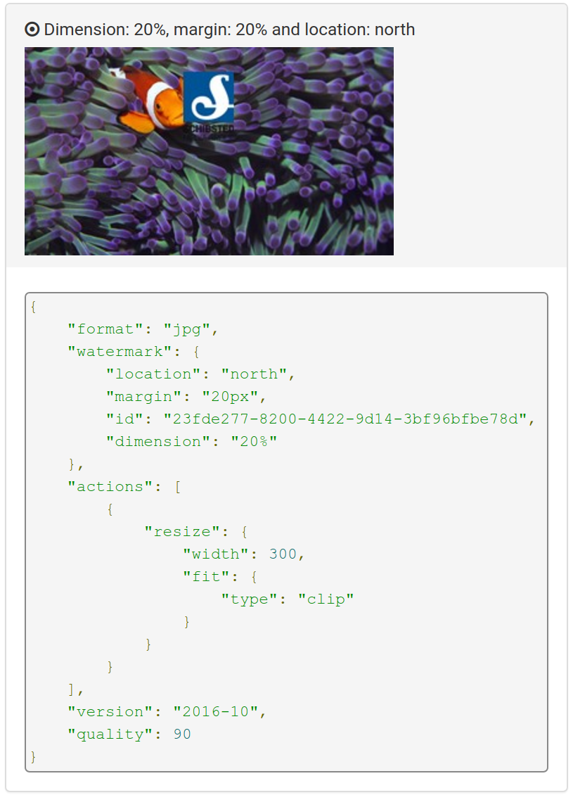
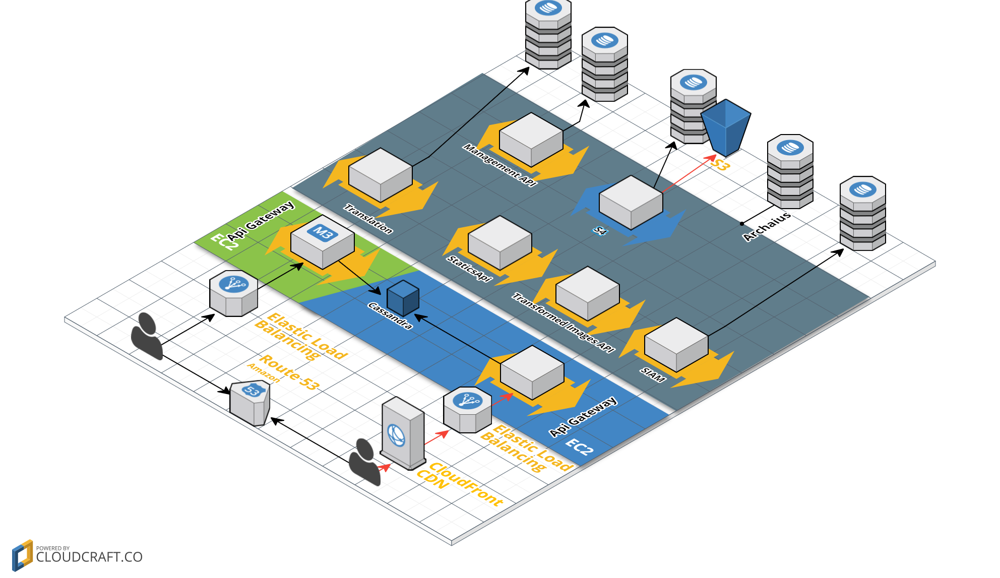
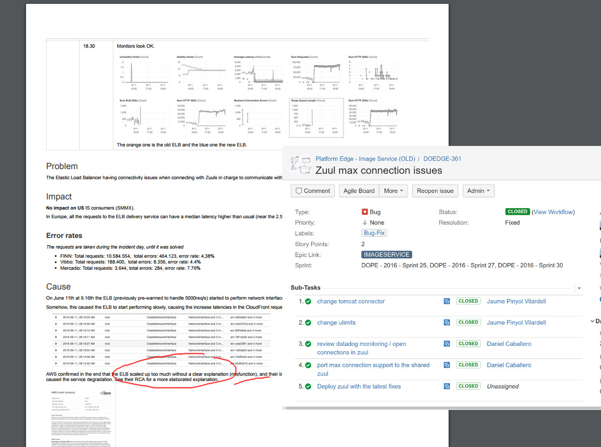

#

## A little bit of context...


## What is Schibsted?
<div id="left">
{ width=90% }
</div>
<div id="right">

</div>

## And SPT?


## 
{ width=35% }

{ width=35% }

## 


##


#

## So what?


## 2016-06-11 - Incident


##
 


## Actual root issue
{ width=75% }

## (Easy) fix...
```bash
$ cat /etc/security/limits.d/tomcat.conf
tomcat hard nofiles 10240
$ cat /etc/tomcat7/server.xml
...
<Connector port="8080" protocol="org.apache.coyote.http11.Http11NioProtocol"
connectionTimeout="20000"
redirectPort="8443" />
...
```

## And some testing...
```go
func connection_handler(id int, host string, port int, wg *sync.WaitGroup) {
    fmt.Println("\t runner "+strconv.Itoa(id)+" is initiating a connection")
    conn, err := net.Dial("tcp", host+":"+strconv.Itoa(port))
    if err != nil {
        fmt.Println(err)
        os.Exit(1)
    }
    fmt.Println("\t runner "+strconv.Itoa(id)+" established the connection")
    connBuf := bufio.NewReader(conn)
    for{
        str, err := connBuf.ReadString('\n')
        if len(str)>0 {
            fmt.Println(str)
        }
        if err!= nil {
            break
        }
    }
    fmt.Println("\t runner "+strconv.Itoa(id)+" got its connection closed")
    wg.Done()
}

func run_threads(numberConnections int, delay int, host string, port int) {
    runtime.GOMAXPROCS(numberConnections)

    var wg sync.WaitGroup
    wg.Add(numberConnections)

    for runner:= 1; runner <= numberConnections ; runner++ {
        fmt.Println("Initiating runner # "+strconv.Itoa(runner))
        go connection_handler(runner, host, port, &wg)
        time.Sleep(time.Duration(delay) * time.Millisecond)
        fmt.Println("Runner "+strconv.Itoa(runner)+" initated. Remaining: "+strconv.Itoa(numberConnections-runner))
    }

    fmt.Println("Waiting runners to finish")
    wg.Wait()
}

func main() {
    hostPtr := flag.String("host", "localhost", "Host you want to open tcp connections against")
    portPtr := flag.Int("port", 8888, "Port you want to open tcp connections against")
    numberConnectionsPtr := flag.Int("connections", 100, "Number of connections you want to open")
    delayPtr := flag.Int("delay", 10, "Number of ms you want to sleep between each connection creation")

    flag.Parse()

    run_threads(*numberConnectionsPtr, *delayPtr, *hostPtr, *portPtr )

    fmt.Println("\nTerminating Program")
}
```

## Executing the tests...

```bash
% ./tcpMaxConn -host ec2-54-229-56-140.eu-west-1.compute.amazonaws.com -port 8080 -connections 5 
Initiating runner # 1
         runner 1 is initiating a connection
Runner 1 initated. Remaining: 4
Initiating runner # 2
         runner 2 is initiating a connection
Runner 2 initated. Remaining: 3
Initiating runner # 3
         runner 3 is initiating a connection
Runner 3 initated. Remaining: 2
Initiating runner # 4
         runner 4 is initiating a connection
Runner 4 initated. Remaining: 1
Initiating runner # 5
         runner 5 is initiating a connection
Runner 5 initated. Remaining: 0
Waiting runners to finish
         runner 2 established the connection
         runner 1 established the connection
         runner 4 established the connection
         runner 3 established the connection
         runner 5 established the connection
         runner 2 got its connection closed
         runner 1 got its connection closed
         runner 4 got its connection closed
         runner 5 got its connection closed
         runner 3 got its connection closed

Terminating Program
```
