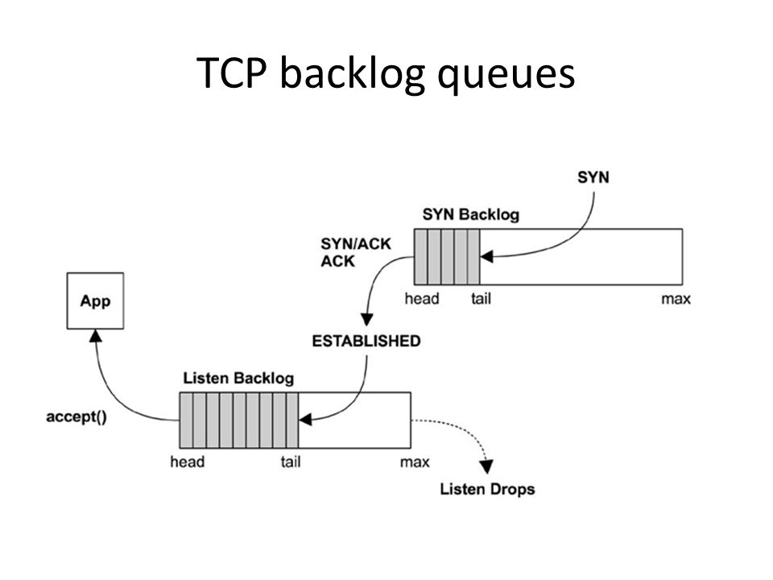
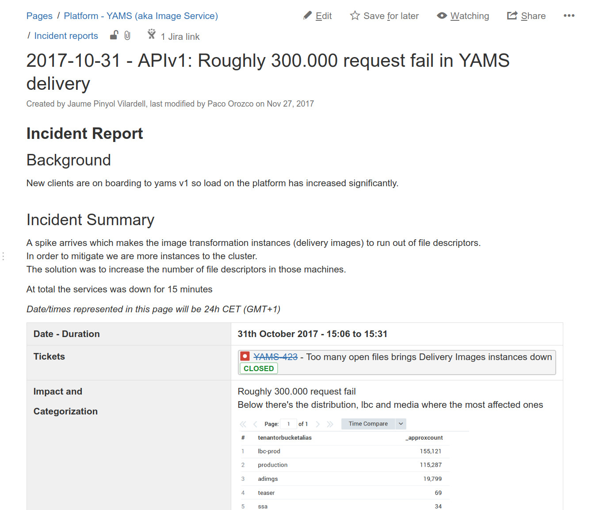
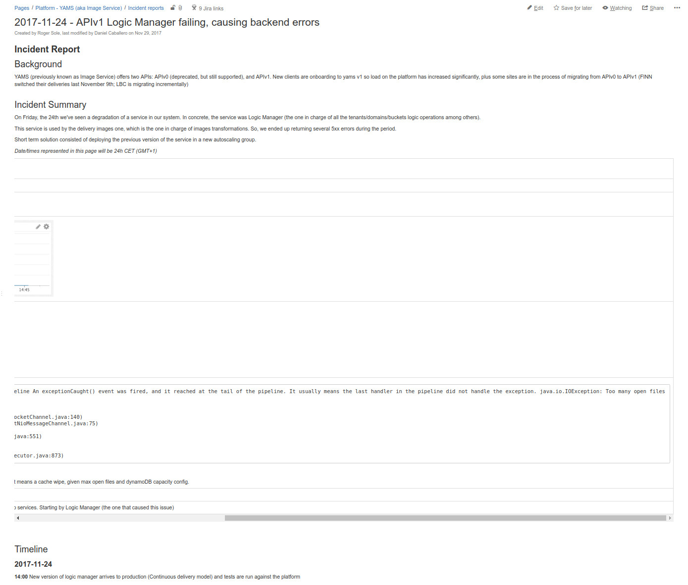

# 

## Is this everything?

No...

## Supporting a relatively high number of connections in parallel...

...is an easy job...

##
... but fragile.

## Back to the basics

{ width=90% }

## Points to bear in mind

* **OS** (net.core.somaxconn, ethernet cards queues, devices backlogs...)
* **max file descriptor limits** *for the user running the service*
* in a multiprocess model (legacy?), max processes limits *for the user running the service*
* **Connector/listener** in your application / application server 
* **Associated thread pools** / incoming requests **queue** (if applies)
* Probably you also want pooling-multiplexing against backends
* Don't forget about other processes using resources
* And is there a **load balancer in front of you?** More considerations may apply

## 

> **If you break a single item, you hit the ground** 

Plus it may not manifest soon; you realize when:

* Lots of ELBs in front of you (normally under high load) pre-opening hundreds of connections
* Or issues with backend components (slow responses?) so in-flight connections increase drastically

## Ook, but you are careful, you review PRs, and you do stress tests...

... *you are safe*. Really?

## New incident

## Incident 2017-10-31

## AND Incident 2017-11-24

## WTF

