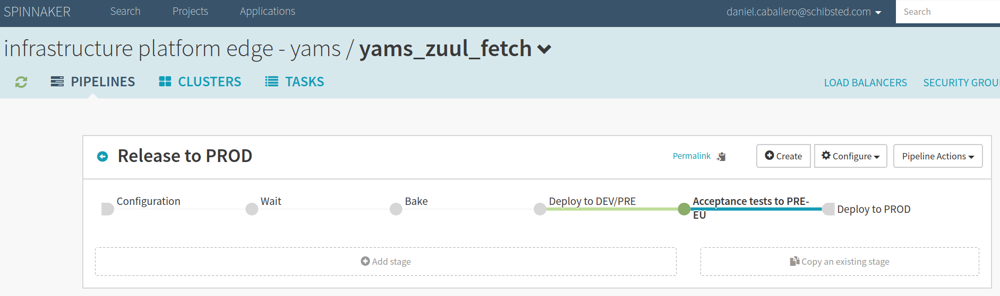
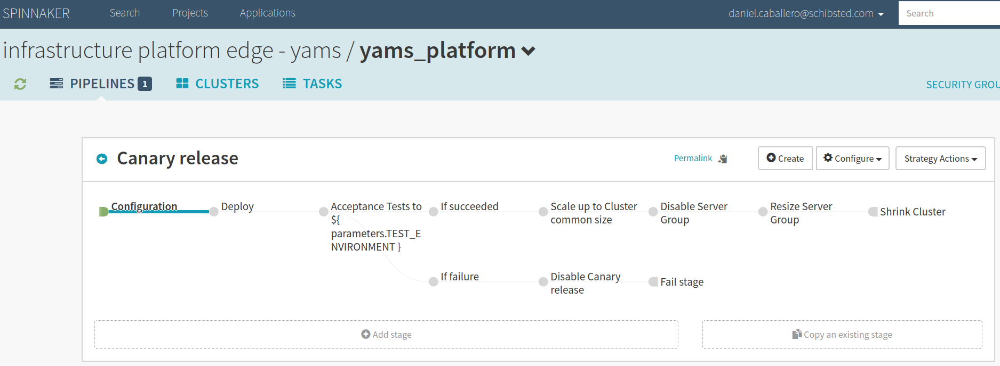
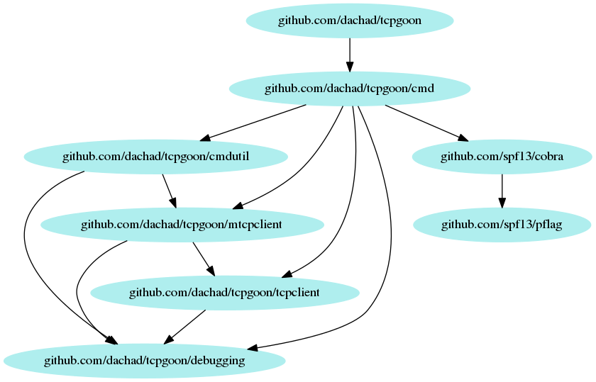

# 

## The solution


## Continuous testing coverage

*Obvious*, but...

> **Should application stress tests already cover this?**

{ width=60% }

## Again, no...


## And building something more...


#

##

{ width=35% }

{ width=35% }

## Approach

* **Mission**: We want something we can easily plug to our test suite that **checks a single instance of our service do 
support an specific number of parallel TCP connections**, without entering into standard l7 (http) stress testing
* Given it requires a deployed version of your application (ideally the same you will use for production), 
**the acceptance test phase is the target place** to plug this check.

## Acceptance tests





## How does it look like?

```bash
% ./tcpgoon --help
tcpgoon tests concurrent connections towards a server listening on a TCP port

Usage:
  tcpgoon [flags] <host> <port>

Flags:
  -y, --assume-yes         Force execution without asking for confirmation
  -c, --connections int    Number of connections you want to open (default 100)
  -d, --dial-timeout int   Connection dialing timeout, in ms (default 5000)
  -h, --help               help for tcpgoon
  -i, --interval int       Interval, in seconds, between stats updates (default 1)
  -s, --sleep int          Time you want to sleep between connections, in ms (default 10)
  -v, --verbose            Print debugging information to the standard error
```
##
```bash
% ./tcpgoon myhttpsamplehost.com 80 --connections 10 --sleep 999 -y 
Total: 10, Dialing: 0, Established: 0, Closed: 0, Error: 0, NotInitiated: 10
Total: 10, Dialing: 1, Established: 1, Closed: 0, Error: 0, NotInitiated: 8
Total: 10, Dialing: 1, Established: 2, Closed: 0, Error: 0, NotInitiated: 7
Total: 10, Dialing: 1, Established: 3, Closed: 0, Error: 0, NotInitiated: 6
Total: 10, Dialing: 1, Established: 4, Closed: 0, Error: 0, NotInitiated: 5
Total: 10, Dialing: 1, Established: 5, Closed: 0, Error: 0, NotInitiated: 4
Total: 10, Dialing: 1, Established: 6, Closed: 0, Error: 0, NotInitiated: 3
Total: 10, Dialing: 1, Established: 7, Closed: 0, Error: 0, NotInitiated: 2
Total: 10, Dialing: 1, Established: 8, Closed: 0, Error: 0, NotInitiated: 1
Total: 10, Dialing: 1, Established: 9, Closed: 0, Error: 0, NotInitiated: 0
Total: 10, Dialing: 0, Established: 10, Closed: 0, Error: 0, NotInitiated: 0
--- myhttpsamplehost.com:80 tcp test statistics ---
Total: 10, Dialing: 0, Established: 10, Closed: 0, Error: 0, NotInitiated: 0
Response time stats for 10 established connections min/avg/max/dev = 17.929ms/19.814ms/29.811ms/3.353ms
% echo $?
0
```

##
```bash
 % tcpgoon -c 5000 -s 0 -y ec2-52-213-210-34.eu-west-1.compute.amazonaws.com 443
Total: 5000, Dialing: 0, Established: 0, Closed: 0, Error: 0, NotInitiated: 5000
Total: 5000, Dialing: 0, Established: 1020, Closed: 0, Error: 3980, NotInitiated: 0
--- ec2-52-213-210-34.eu-west-1.compute.amazonaws.com:443 tcp test statistics ---
Total: 5000, Dialing: 0, Established: 1020, Closed: 0, Error: 3980, NotInitiated: 0
Response time stats for 1020 established connections min/avg/max/dev = 116.443ms/313.739ms/549.88ms/111.426ms
Time to error stats for 3980 failed connections min/avg/max/dev = 105.145ms/145.092ms/316.247ms/39.371ms
```


## And internally?


## Baking

Nothing especially interesting (*a docker wrapper does exist so we can run travis logic locally*):
```bash
./_script/test
./_script/formatting_checks

TRAVIS_PULL_REQUEST=${TRAVIS_PULL_REQUEST:-""}
TRAVIS_BRANCH=${TRAVIS_BRANCH:-""}
if [ "$TRAVIS_PULL_REQUEST" == "false" ] && [ "$TRAVIS_BRANCH" = "master" ]
then
    echo "INFO: Merging to master... time to build and deploy redistributables"
    docker_name="dachad/tcpgoon"
    ./_script/build "$docker_name"
    ./_script/deploy "$docker_name"
fi
```

**But...**

## No, you cannot just move binaries around


## Testing...

> *Are we testing this test?* :)

* A basic tcpserver is included and in use by the project tests.
* Eureka integration is using *dockertest* to initialize and shutdown a dockered Eureka instance.

