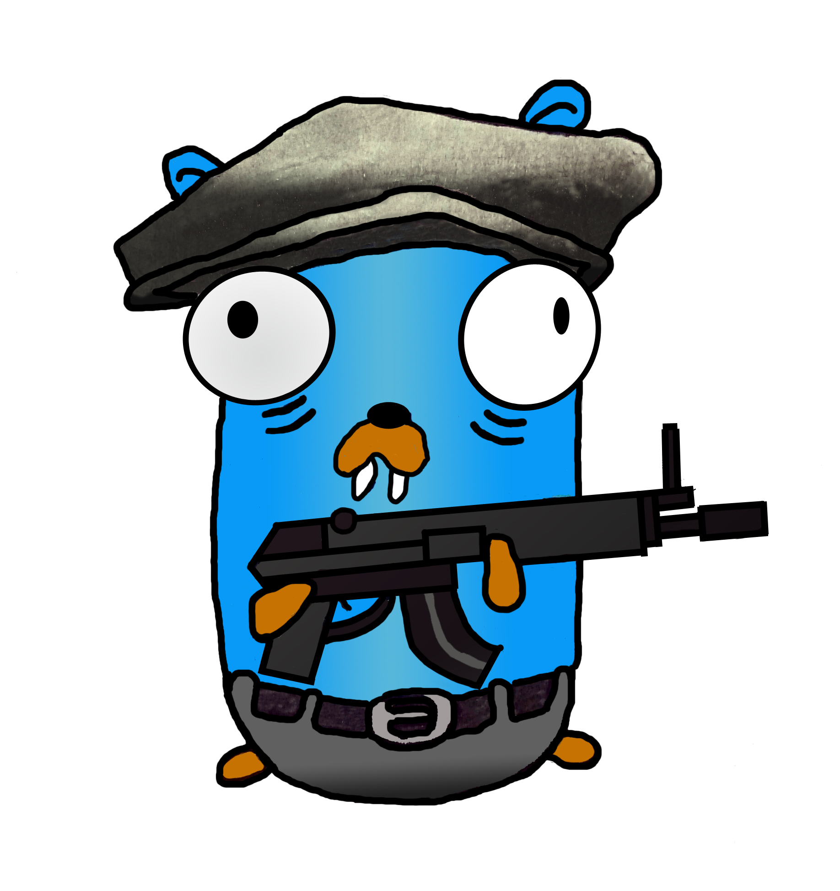

# 

## The solution


## Continuous testing coverage

> *Obvious*, but...

* Its does not mean building a new feature. 
* Neither building a new service. 
* It does not reduce the service's cost. 
* It does not directly help another team
* It does not increase Infra visibility
* And the chance we hit again the same issue "is low"

##

So, of course, no focus...


##

> **Let's use personal OKRs for something fun&usable!**

{ width=35% }

{ width=35% }

## Approach

* **Mission**: We want something we can easily plug to our test suite that **checks a single instance of our service do support an specific number of parallel TCP connections**
* Given it requires a deployed version of your application (ideally the same you will use for production), **the acceptance test phase is the target place** to plug this check.

## How does it look like?

```bash
% ./tcpgoon --help
tcpgoon tests concurrent connections towards a server listening on a TCP port

Usage:
  tcpgoon [flags] <host> <port>

Flags:
  -y, --assume-yes         Force execution without asking for confirmation
  -c, --connections int    Number of connections you want to open (default 100)
  -d, --dial-timeout int   Connection dialing timeout, in ms (default 5000)
  -h, --help               help for tcpgoon
  -i, --interval int       Interval, in seconds, between stats updates (default 1)
  -s, --sleep int          Time you want to sleep between connections, in ms (default 10)
  -v, --verbose            Print debugging information to the standard error
```
##
```bash
% ./tcpgoon myhttpsamplehost.com 80 --connections 10 --sleep 999 -y 
Total: 10, Dialing: 0, Established: 0, Closed: 0, Error: 0, NotInitiated: 10
Total: 10, Dialing: 1, Established: 1, Closed: 0, Error: 0, NotInitiated: 8
Total: 10, Dialing: 1, Established: 2, Closed: 0, Error: 0, NotInitiated: 7
Total: 10, Dialing: 1, Established: 3, Closed: 0, Error: 0, NotInitiated: 6
Total: 10, Dialing: 1, Established: 4, Closed: 0, Error: 0, NotInitiated: 5
Total: 10, Dialing: 1, Established: 5, Closed: 0, Error: 0, NotInitiated: 4
Total: 10, Dialing: 1, Established: 6, Closed: 0, Error: 0, NotInitiated: 3
Total: 10, Dialing: 1, Established: 7, Closed: 0, Error: 0, NotInitiated: 2
Total: 10, Dialing: 1, Established: 8, Closed: 0, Error: 0, NotInitiated: 1
Total: 10, Dialing: 1, Established: 9, Closed: 0, Error: 0, NotInitiated: 0
Total: 10, Dialing: 0, Established: 10, Closed: 0, Error: 0, NotInitiated: 0
--- myhttpsamplehost.com:80 tcp test statistics ---
Total: 10, Dialing: 0, Established: 10, Closed: 0, Error: 0, NotInitiated: 0
Response time stats for 10 established connections min/avg/max/dev = 17.929ms/19.814ms/29.811ms/3.353ms
% echo $?
0
```

## And internally?


## Let's see some code
```go
func TCPConnect(id int, host string, port int, wg *sync.WaitGroup,
    statusChannel chan<- Connection, closeRequest <-chan bool) error {
...
for {
        select {
        case <-closeRequest:
            fmt.Fprintln(debugging.DebugOut, "Connection", id, "is being requested to close")
            wg.Done()
            return nil
        default:
            const ReadTimeoutAndBetweenPollsInMs = 1000
            conn.SetReadDeadline(time.Now().Add(time.Duration(ReadTimeoutAndBetweenPollsInMs) * time.Millisecond))
            str, err := connBuf.ReadString('\n')
            if terr, ok := err.(net.Error); ok && terr.Timeout() {
                fmt.Fprintln(debugging.DebugOut, "No info from connection", id, "before timing out. Reading again...")
            } else if err != nil {
                fmt.Fprintln(debugging.DebugOut, "Connection", id, "looks closed. Error", reflect.TypeOf(err), "when reading:")
                fmt.Fprintln(debugging.DebugOut, err)
                connectionDescription.status = ConnectionClosed
                reportConnectionStatus(statusChannel, connectionDescription)
                wg.Done()
                return err
            } else if len(str) > 0 {
                fmt.Fprintln(debugging.DebugOut, "Connection", id, "got", str)
            }
        }

    }
}
```

##
```go
func StartBackgroundClosureTrigger(gc GroupOfConnections) <-chan bool {
    closureCh := make(chan bool)

    signalsCh := make(chan os.Signal, 1)
    registerProperSignals(signalsCh)

    go closureMonitor(gc, signalsCh, closureCh)
    return closureCh
}

func registerProperSignals(signalsCh chan os.Signal) {
    signal.Notify(signalsCh, syscall.SIGINT, syscall.SIGTERM)
}

func closureMonitor(gc GroupOfConnections, signalsCh chan os.Signal,
    closureCh chan bool) {
    const pullingPeriodInMs = 500
    for {
        select {
        case signal := <-signalsCh:
            fmt.Fprintln(debugging.DebugOut, "We captured a closure signal:", signal)
            close(closureCh)
            return
        case <-time.After(pullingPeriodInMs * time.Millisecond):
            if !gc.PendingConnections() {
                close(closureCh)
                return
            }
        }
    }
}
```
## Baking

Nothing especially interesting (*a docker wrapper does exist so we can run travis logic locally*):
```bash
./_script/test
./_script/formatting_checks

TRAVIS_PULL_REQUEST=${TRAVIS_PULL_REQUEST:-""}
TRAVIS_BRANCH=${TRAVIS_BRANCH:-""}
if [ "$TRAVIS_PULL_REQUEST" == "false" ] && [ "$TRAVIS_BRANCH" = "master" ]
then
    echo "INFO: Merging to master... time to build and deploy redistributables"
    docker_name="dachad/tcpgoon"
    ./_script/build "$docker_name"
    ./_script/deploy "$docker_name"
fi
```

**But...**

## No, you cannot just move binaries around


## 
```bash
function binary_compilation {
    # mix of:
    #  traefik build
    #  http://blog.wrouesnel.com/articles/Totally%20static%20Go%20builds/
    #  https://www.osso.nl/blog/golang-statically-linked/
    #  https://github.com/kubernetes/kubernetes/pull/26028/files
    # see also https://gcc.gnu.org/onlinedocs/gcc/Link-Options.html
    CGO_ENABLED=0 GOOS=linux go build -o out/tcpgoon \
            -ldflags '-extldflags "-static"' -a -installsuffix nocgo -tags netgo
}

```

## Testing...

> *Are we testing this test?* :)

* A basic tcpserver is included and in use by the project tests.
* Eureka integration is using *dockertest* to initialize and shutdown a dockered Eureka instance.

