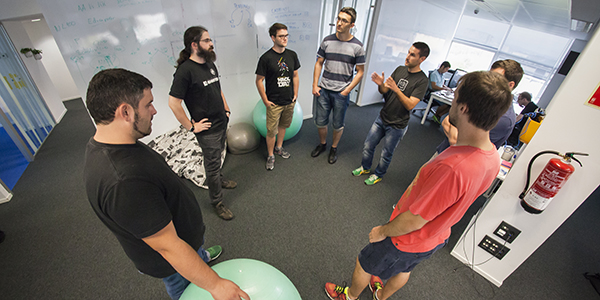
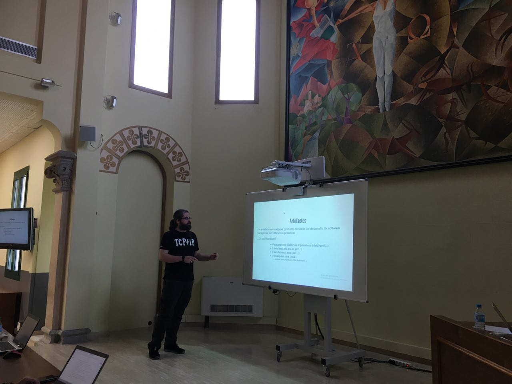
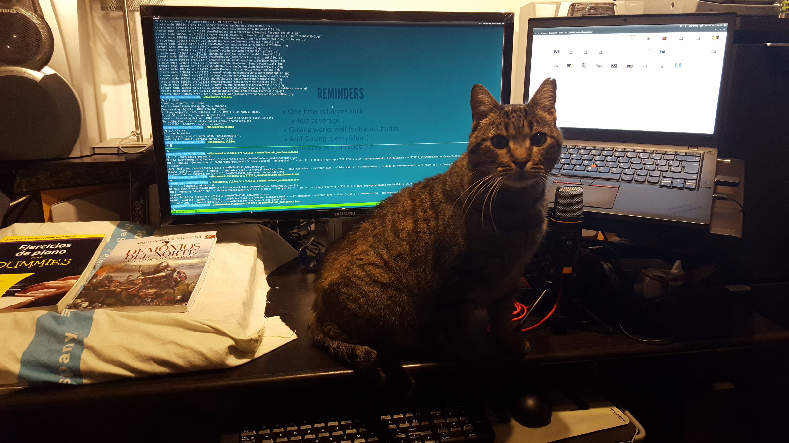
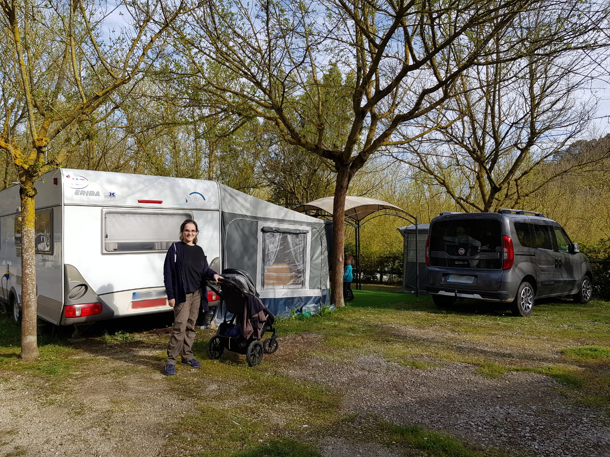

% YAHSS 
% Yet Another High Scalability Story
% dani(dot)caba at gmail(dot)com

#

## Who are you?

```go
dcProfile := map[string]string{
  "name": "Daniel Caballero",
  "title": "Devops Engineer",
  "mail": "dani(dot)caba at gmail(dot)com",
  "company": &SchibstedPT,
  "previously_at": []company{&NTTEurope, &Semantix, &Oracle},
  "linkedin": http.Get("https://www.linkedin.com/in/danicaba"),
  "extra": "Gestión DevOps de Arquitecturas IT@LaSalle",
}
```

## So... I work



## ... I (some kinda) teach

{ width=65% }

## ... I (try to) program...

{ width=70% }

## ... I (would like to) rock...

{ width=35% }

## ... and I live

{ width=70% }

## So... I really value my time

## And I really don't like to waste it resolving production alerts


