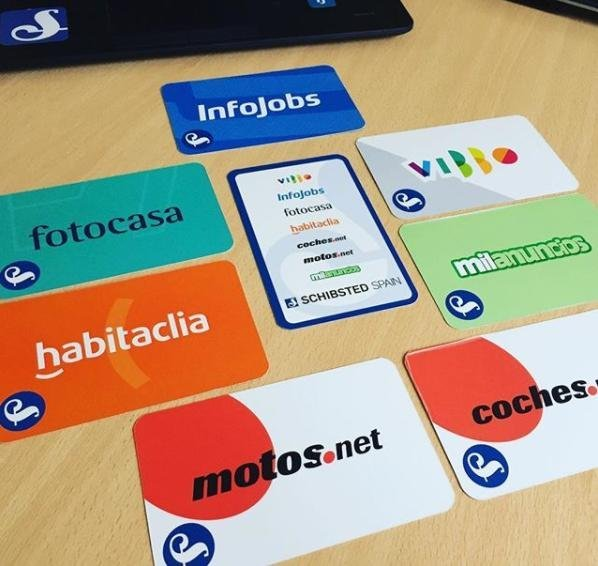
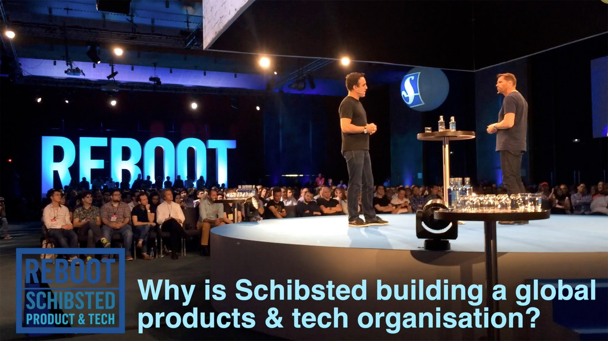
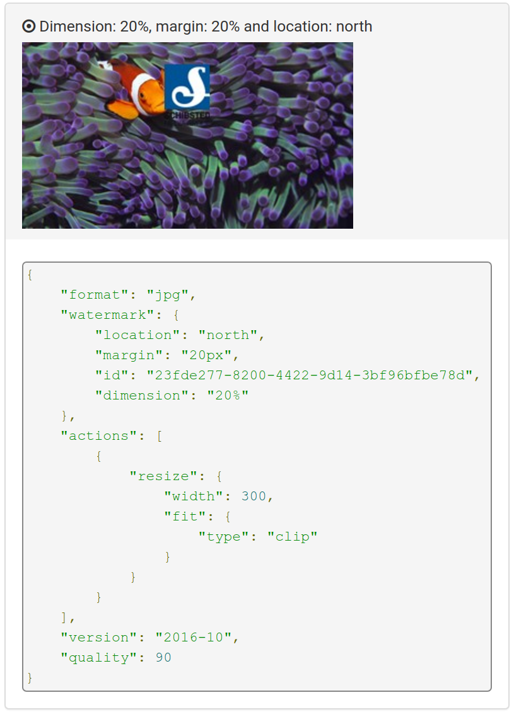
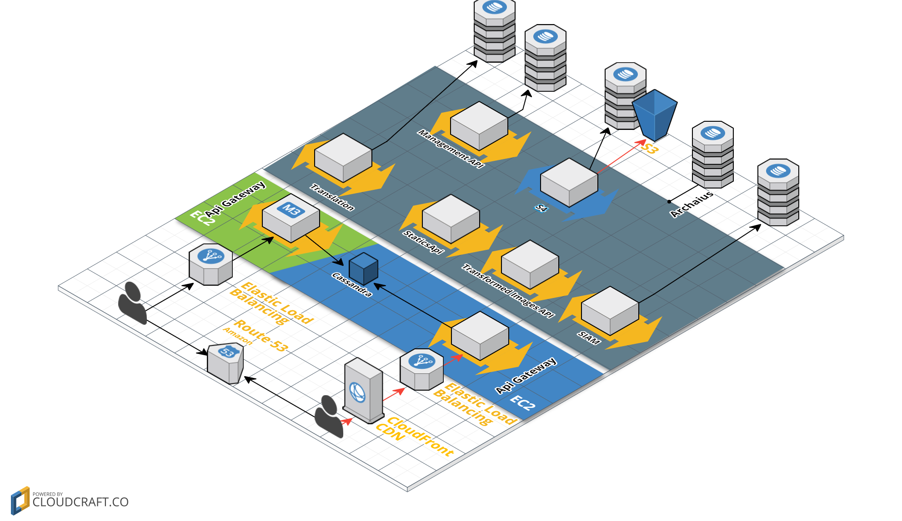
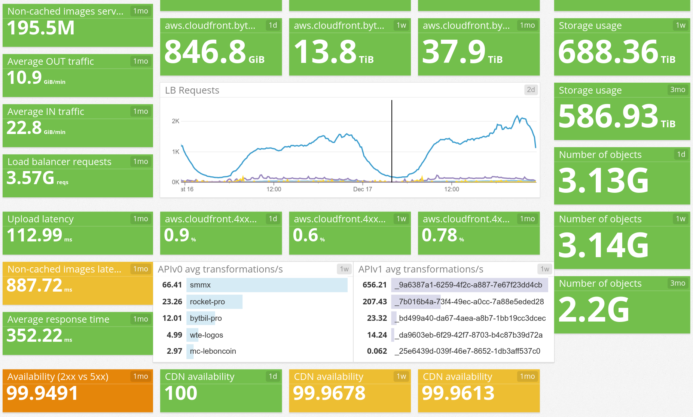

#

## What is Schibsted?

{ width=90% }

## And SPT?

## And YAMS?

{ width=35% }

{ width=35% }

## Brief service history

## 

##

## Why not offline transformations?

## Why not reusing alternatives?
imaginarium
sch media

## Why not CDN/edge transformations?

## Self service capabilities

## Why not before?

We were busy. We had a lot of fun... at a high cost

## We are actually devops

No ops/support team

## Why transformations in golang?
