#

##
{ style="border:0; width:30.0%" }

##
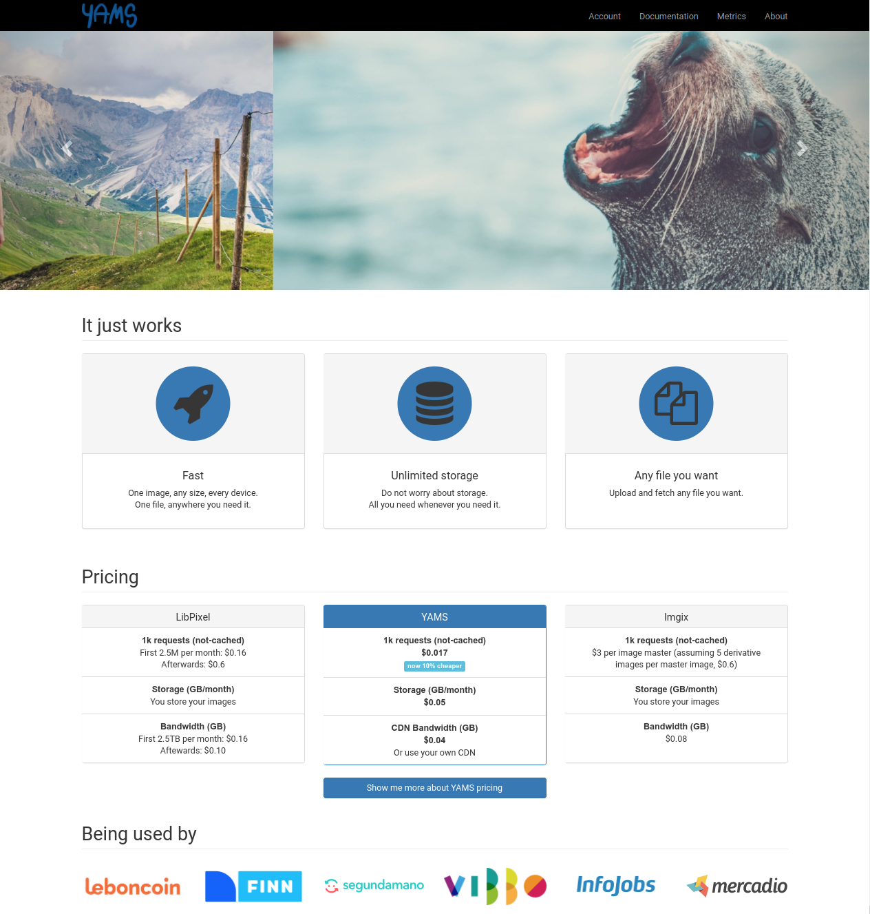{ width=70% }

## 

```json
{
    "format": "jpg",
    "watermark": {
        "location": "north",
        "margin": "20px",
        "dimension": "20%"
    },
    "actions": [
        {
            "resize": {
                "width": 300,
                "fit": {
                    "type": "clip"
                }
            }
        }
    ],
    "quality": 90
}
```

#

## The journey

## 2+1/2 YEARS AGO
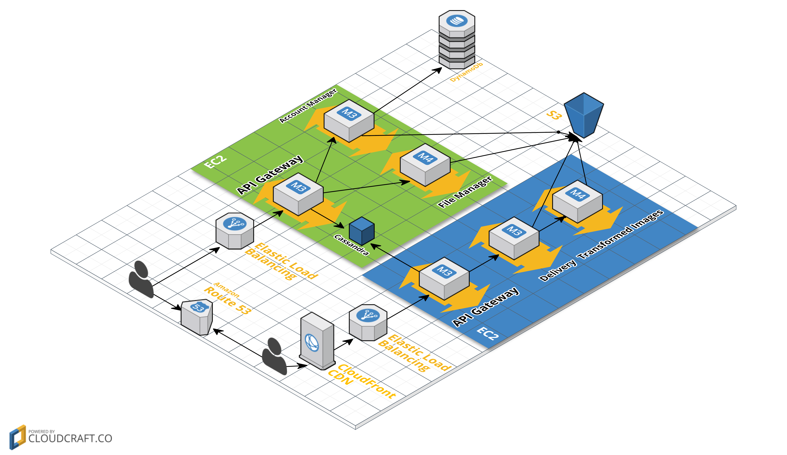

##


## Firsts onboardings
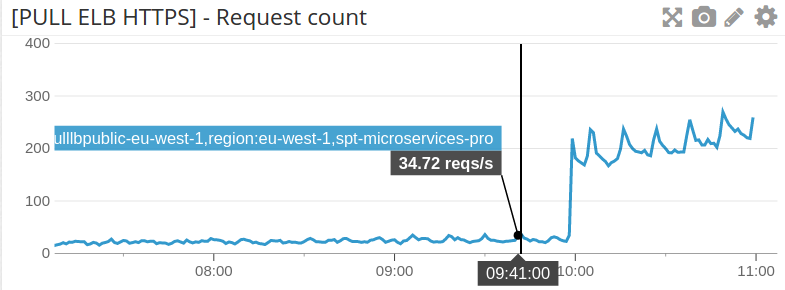

## Onboarding pipelines
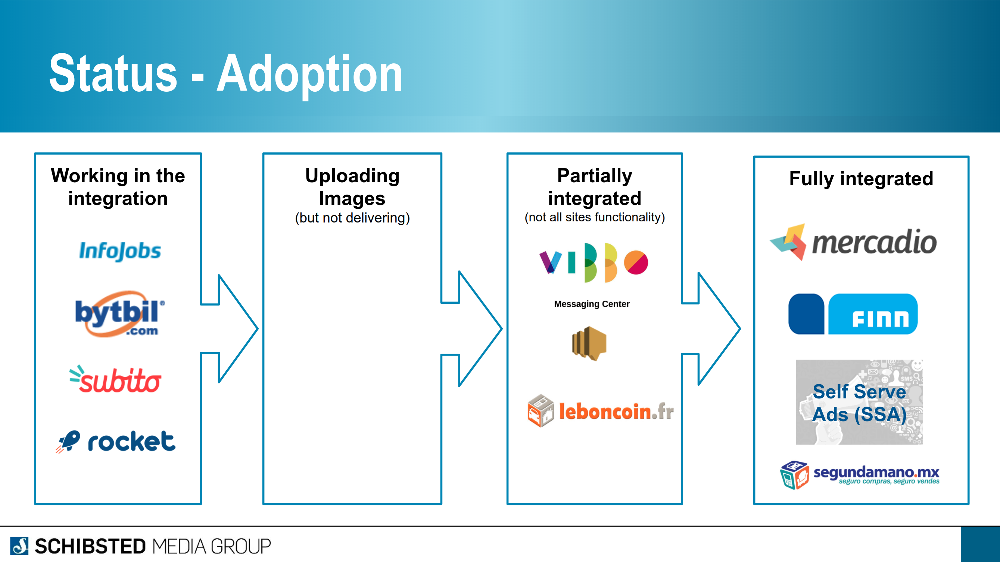

## Firsts nightmares
{ width=80% }

##


##
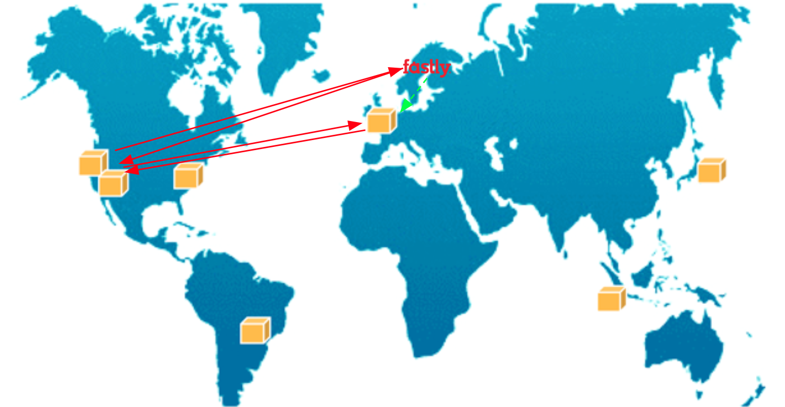

## First (quite manual) release process


## New Architecture
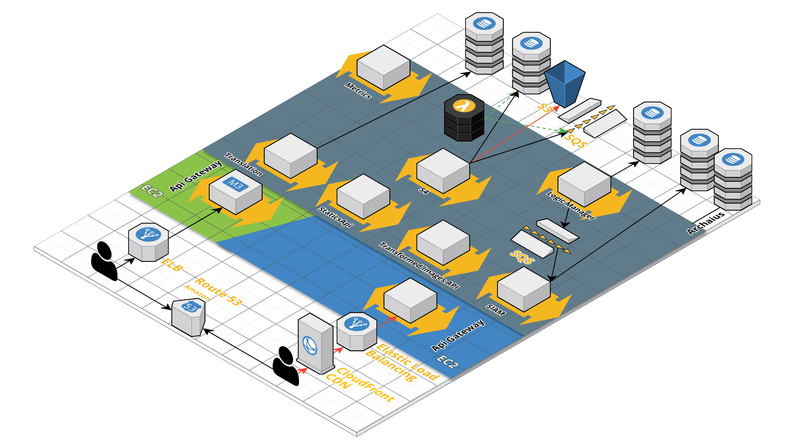

## New Core
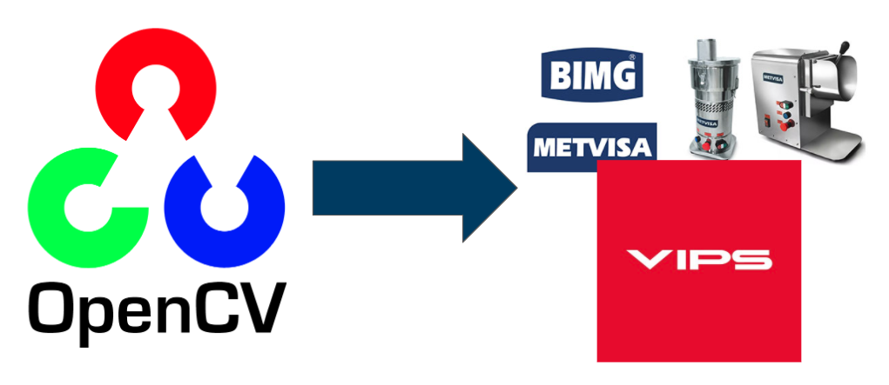

## Self service capabilities
{ width=60% }

## Updated onboarding pipelines
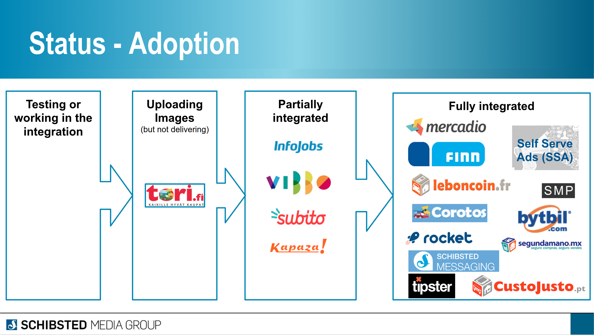

## Current usage


# 

## (Your?) thoughts so far...

## Why maintaining your own service? 

##


##


## 
<div id="left">

</div>
<div id="right">
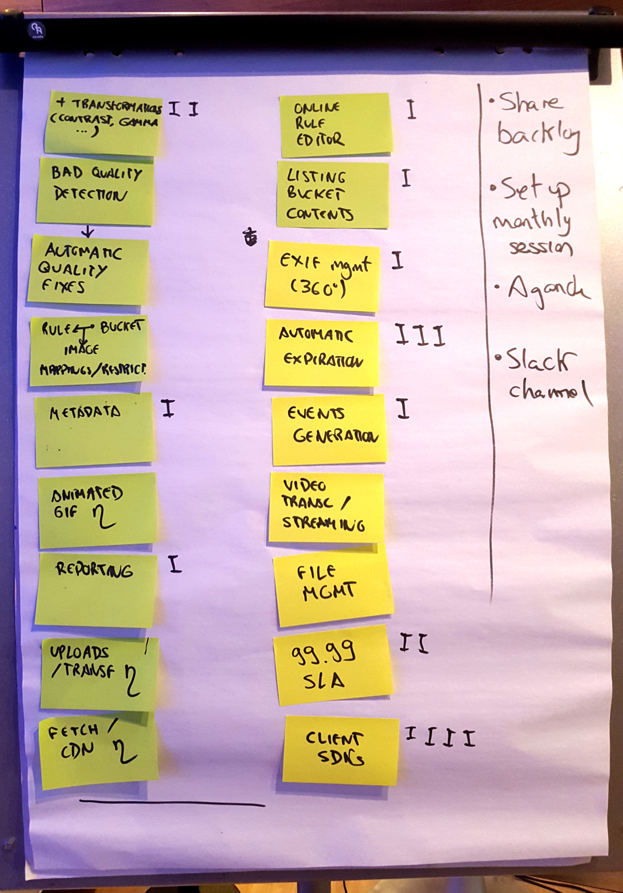{ width=85% }
</div>

##


## But there's already opensource http servers for that, right?

##

* [Imbo](https://github.com/imbo/imbo)
* [imaginary](https://github.com/h2non/imaginary)
* [picfit](https://github.com/thoas/picfit)

## Why not offline transformations?

##
{ width=80% }

## Why microservices?

## +
* *Quicker releases*
* APIGW helps to delegate common functionality
    * But *business agnostic ones*
* *Reusability* of individual microservices
* Each microservice can choose *different techs* 
    * We will focus in delivery-images, in Golang
* Easier to scale with the organization/development team
    * Not taking advantage
* More granular scalability
* and... *fun*

## -
* S2S *communication overhead*
* It can imply extra *costs*
* More *tooling* required (logging, tracing...)
* Reproduce the complete environment becomes tricky
* Always caring about coupled services...
    
##     
    


## Why not CDN/edge transformations?

##

* Some functionality may be covered...
    * Typically resizing and format conversion
    * But *not all our functionality* (watermarking?)
* It may mean duplicated processing
* Not easy to pack something like libvips as lambdas
* *No unique & global CDN* in Schibsted

## Not a new story... why not presenting it before?

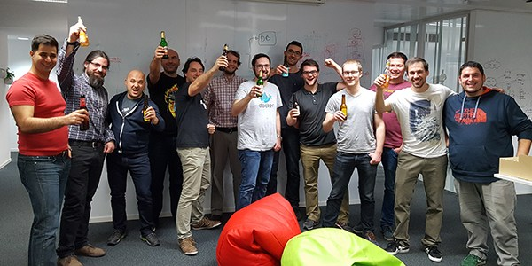

##


## Why transformations in golang?

## Transformation library
* imageflow was not production ready two years ago, with clear gaps on functionalities and bindings

{ width=60% }

##
{ style="border:0" }

## Choosing the programming language 
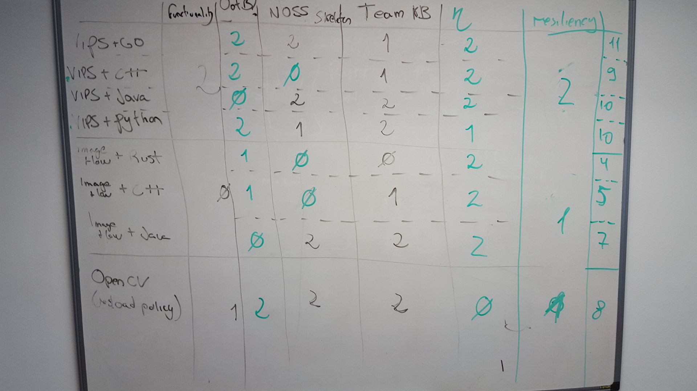

