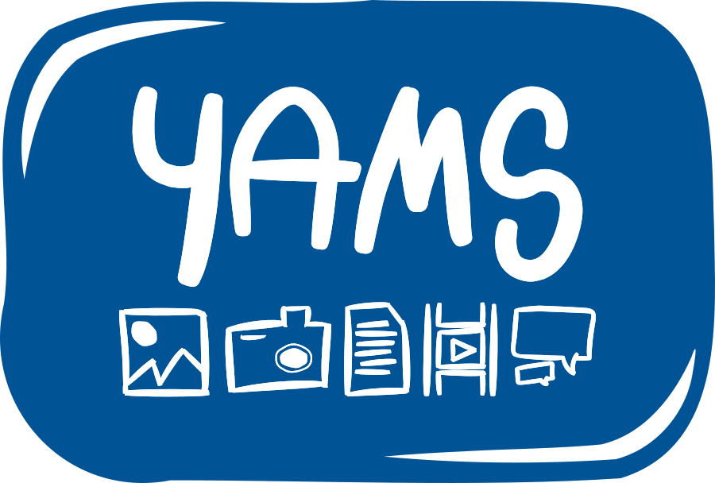
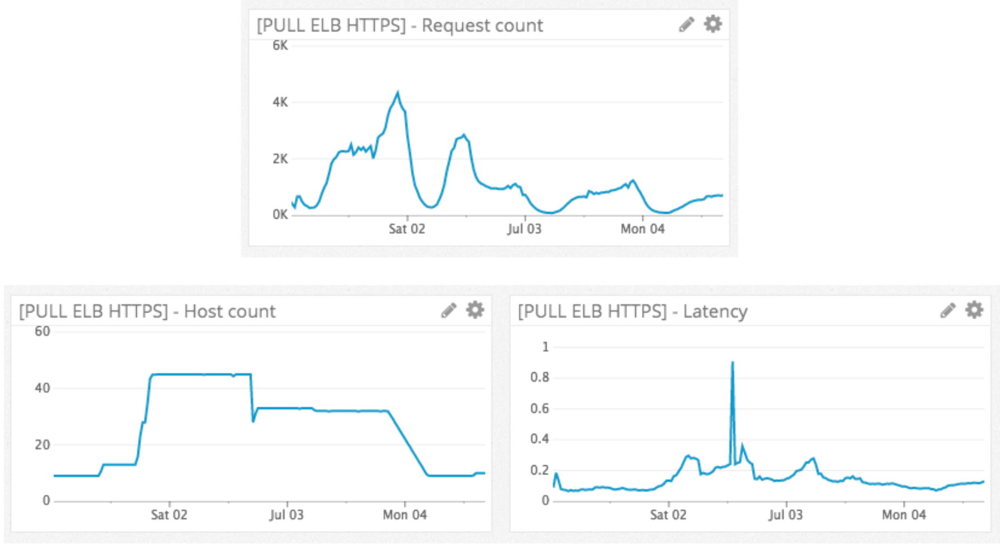
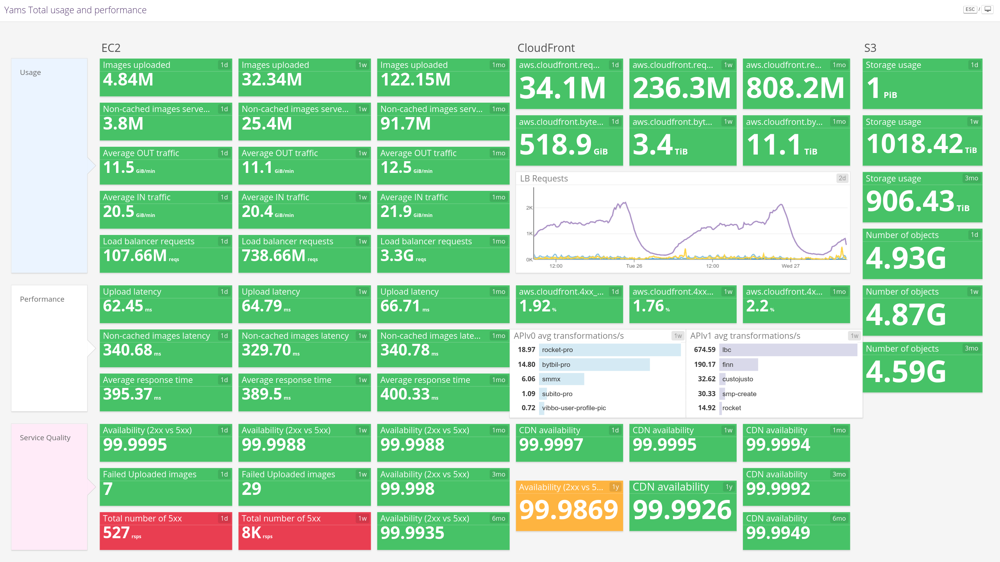

#

##
{ style="border:0; width:30.0%" }

##
{ width=70% }

## 

```json
{
    "format": "jpg",
    "watermark": {
        "location": "north",
        "margin": "20px",
        "dimension": "20%"
    },
    "actions": [
        {
            "resize": {
                "width": 300,
                "fit": {
                    "type": "clip"
                }
            }
        }
    ],
    "quality": 90
}
```

#

## The journey

## 2+1/2 YEARS AGO


##


## Firsts onboardings


## Onboarding pipelines


## Firsts nightmares


##


## 


#

## New Architecture


## New Core


## Updated onboarding pipelines


## Current usage


# 

## (Your?) thoughts so far...

## Why building your own service? 

## Why not offline transformations?

## Why microservices?

## Why not reusing alternatives?
imaginarium
sch media

## Why not CDN/edge transformations?

## Self service capabilities

## Not a new story... why not presenting it before?

{ width=60% }

## Why transformations in golang?

* libvips was very worth:

##

* comparing languages ...

Golang was worth!
