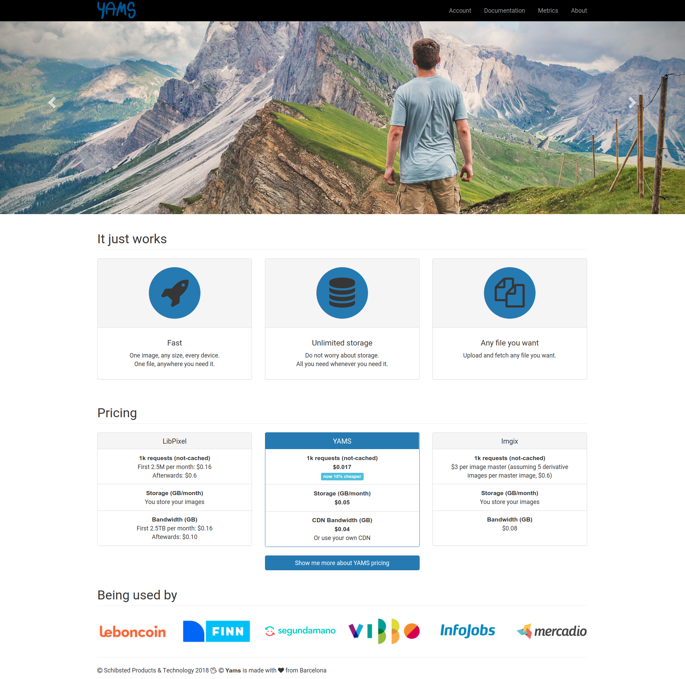

#

##
{ style="border:0; width:30.0%" }

##
{ width=65% }

## 

```json
{
    "format": "jpg",
    "watermark": {
        "location": "north",
        "margin": "20px",
        "dimension": "20%"
    },
    "actions": [
        {
            "resize": {
                "width": 300,
                "fit": {
                    "type": "clip"
                }
            }
        }
    ],
    "quality": 90
}
```

#

## The journey

## 2+1/2 YEARS AGO


##


## Firsts onboardings

## Onboarding pipelines

## Firsts nightmares

## New Architecture

## New Core

## Updated onboarding pipelines

## Current usage

# 

## Thoughts so far...

## Why building your own service? 

## Why not offline transformations?

## Why not reusing alternatives?
imaginarium
sch media

## Why not CDN/edge transformations?

## Self service capabilities

## Why not before?

We were busy. We had a lot of fun... at a high cost
{ width=40% }

## Why transformations in golang?
