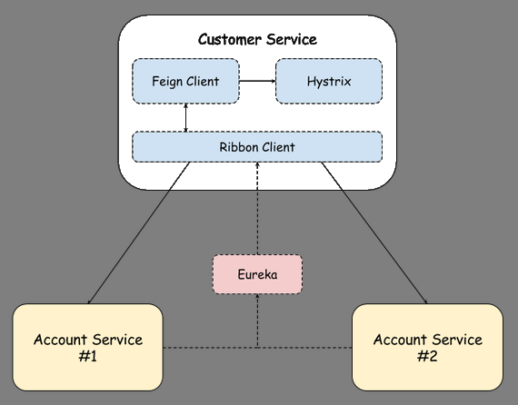
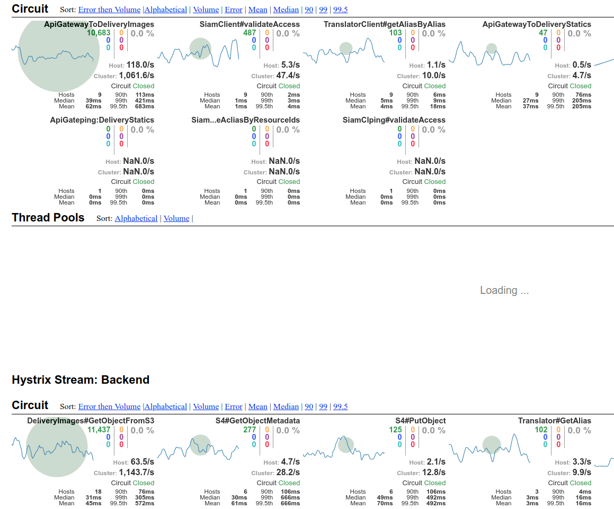

#

## Platform (& development) properties

## IaC

* Most of the services in *AWS*...
* Generating Cloudformations from [python troposphere](https://github.com/cloudtools/troposphere)
* Managing Cloudformation deployments with [Sceptre](https://github.com/cloudreach/sceptre) 
* New projects with infrastructure definition in the same repo than the service code
    * Trying to extend *CD to Infrastructure*
* We have assessed [AWS GoFormation](https://github.com/awslabs/goformation)
    * But still lacks some functionality, like GetAtt or Ref 

## Devel bots
{ width=60% }

<!--
## Code reviews

```yaml
reviewersRaffle:
  strategies:
    - team-with-knowledge-candidates:
        size: 1
        type: knowledge
        participants:
          teams:
            - spt-infrastructure/edge-team
    - team-random-candidates:
        type: sequential
        size: 2
        participants:
          teams:
            - spt-infrastructure/edge-team
  dailyReminder: enabled
slack:
  - "#spt-edge-prs"
```
-->

## Code reviews


#

## Continuous integration and delivery

## Travis
```yaml
language: go
go:
- 1.9.3

script:
- diff -u <(echo -n) <(gofmt -s -d $(find . -type f -name '*.go' -not -path "./vendor/*"))
- docker login -u="$ARTIFACTORY_USER" -p="$ARTIFACTORY_PASSWORD" containers.schibsted.io
- "./requirements/start-requirements.sh -d"
- "_script/tests-docker"
- "_script/compile-docker"
- "_script/cibuild"

deploy:
  skip_cleanup: true
  on:
    all_branches: true
  provider: script
  script: _script/deploy
```

## FPM
```bash
fpm -s dir \
	-t rpm \
	-n ${PACKAGE_NAME}${DEV} \
	-v ${VERSION} \
        --iteration ${ITERATION} \
	--description "Yams delivery images. Commit: ${GIT_COMMIT_ID}" \
	--before-install ${TRAVIS_BUILD_DIR}/_pkg/stopservice \
	--after-install ${TRAVIS_BUILD_DIR}/_pkg/postinst \
	--before-remove ${TRAVIS_BUILD_DIR}/_pkg/stopservice \
	--depends datadog-config \
	--depends sumologic-config \
	${DIST_PATH}/${PACKAGE_NAME}/=/
```

## Hardened images
{ width=80% }

## Spinnaker


##


##


## Acceptance & Stress testing

## Locust
{ width=80% }

## Vegeta
{ width=50% }

##


## Configuration management
* Using [Netflix Archaius](https://github.com/Netflix/archaius) in all rxJava services
    * Configured with dynamo tables...
    * so dynamic reconfiguration is possible...
    * and quite useful when dealing with outages :)
* ... but [Viper](https://github.com/spf13/viper) in delivery-images
    * No support of DynamoDB to store configurations (etcd, consul)
    * We missed [support of "Get with default"](https://github.com/spf13/viper/pull/232) functions

##


#

## Observability

## Logs 
* Using *Sumologic* to aggregate them into a central location
    * Now quite happy... but costs (logging 100G per day)
    * Daemon/sidecar with specific config (files to forward)
    
{ width=80% }   
   
##
Using [logrus](https://github.com/sirupsen/logrus) in delivery-images

* Disabling locking
* Time/Date formatting equivalent to the logs in Java
* [Zap](https://github.com/uber-go/zap) could be used... 
    * but not concerned about overhead, as...
    * fetching and transforming images are massive ops in comparison

## Monitoring and alerting

* We use *Datadog*
    * System + Custom application metrics 
        * Via *statsd*, sidecar model (again)
    * Importing also *Cloudwatch* metrics
* Extensive usage of:
    * Dashboards (troubleshooting and also KPIs)
    * Alerting
    
##
{ width=100% }

##
```yaml
  pre:
    not_allowed_notify_to:
    - "@webhook-alert-gateway-sev2"
    - "@pagerduty"
    healthy_host_count_critical: 0.0
  pro:
    healthy_host_count_critical: 1.0

monitors:
  - name: "[ALB] - {{name.name}} in region {{region.name}} - 5xx backend error rate"
    tags:
      - "app:yams"
    type: "metric alert"
    options:
      require_full_window: false
      thresholds:
        warning: 0.05
        critical: 0.1
      notify_no_data: false
```
    
<!--
## Pagerduty onCall escalations

-->

## Distributed tracing


##


## Integration


##


## Where?

* *httserver*, as a middleware 
    * so *incoming requests*' headers are considered
* all functions *where you want to add instrumentation*
* *client factory*
    * to *propagate spans to outgoing requests*

##
```go
n := negroni.New(recovery)

n.Use(NewRequestIdHandler())
n.Use(tracing.NewTracingHandler())
n.Use(negroni.NewStatic(http.Dir(serverConfig.schemaDir)))

loggingMiddleware := negronilogrus.NewMiddlewareFromLogger(serverConfig.log, "bumblebee")
loggingMiddleware.SetLogStarting(false)
n.Use(loggingMiddleware)

n.Use(statsMiddleware)
n.UseHandler(httpRouter)
return n
```

##
```go
if transformedImage.FromCache {
    b.Logger.WithField("id", requestId).Debug("Found Transformation in cache")
    tracing.AddLogToSpanInContext(request.Context(), "Got image from cache")
    b.Monitor.Incr("transformation.cache.hit", tags, 1)
} else {
    b.Monitor.Incr("transformation.cache.miss", tags, 1)
    transformationElapsed := time.Since(transformationStart)
    transformationElapsedInMillis := float64(transformationElapsed.Nanoseconds()) / 1000.0
    b.Monitor.TimeInMilliseconds("request.transformation.duration", transformationElapsedInMillis, tags, 1)
    b.Monitor.Gauge("request.transformation.duration", transformationElapsedInMillis, tags, 1)
    b.Logger.WithField("id", requestId).Debug("Transformation took: ", transformationElapsed.Seconds(), " secs")
    tracing.AddLogKvToSpanInContext(request.Context(), "transformation.duration", transformationElapsed.String())
}
```
# 

## S2S resiliency



## Actors in delivery-images

* *eureka*
* [fargo](https://github.com/hudl/fargo) (!)
* [gokit load balancing](github.com/go-kit/kit/sd/lb)
* [go-hystrix](https://github.com/afex/hystrix-go)

## Implementation detail
```go
viper.SetDefault("eureka.datacenter", amazonDatacenterInfo)
datacenter := viper.GetString("eureka.datacenter")
if datacenter == k8DatacenterInfo {
    var err error
    appInstance, err = sdeureka.NewK8SFargoInstance(eurekaConfig)
    if err != nil {
        return nil, nil, err
    }
} else if datacenter == amazonDatacenterInfo {
    awsSession, err := session.NewSession()
    if err != nil {
        log.Info("registerEureka", "error creating an AWS session", "message", err)
        return nil, nil, err
    }

    instanceMeta := ec2metadata.New(awsSession)
    appInstance, err = sdeureka.NewAwsFargoInstance(log, eurekaConfig, instanceMeta)
    if err != nil {
        return nil, nil, err
    }
} else if datacenter == localDatacenterInfo {
    var err error
    appInstance, err = sdeureka.NewLocalFargoInstance(eurekaConfig)
    if err != nil {
        return nil, nil, err
    }
```

##
```go
hystrix.ConfigureCommand("DeliveryImages#GetWatermarkFromLogicManager", hystrix.CommandConfig{
    Timeout:               viper.GetInt("hystrix.command.DeliveryImagesGetWatermarkFromLogicManager.timeout"),
    MaxConcurrentRequests: viper.GetInt("hystrix.command.DeliveryImagesGetWatermarkFromLogicManager.maxConcurrentRequests"),
    ErrorPercentThreshold: viper.GetInt("hystrix.command.DeliveryImagesGetWatermarkFromLogicManager.errorPercentThreshold"),
})

hystrix.ConfigureCommand("DeliveryImages#GetResourceByAliasFromTranslator", hystrix.CommandConfig{
    Timeout:               viper.GetInt("hystrix.command.GetResourceByAliasFromTranslator.timeout"),
    MaxConcurrentRequests: viper.GetInt("hystrix.command.GetResourceByAliasFromTranslator.maxConcurrentRequests"),
    ErrorPercentThreshold: viper.GetInt("hystrix.command.GetResourceByAliasFromTranslator.errorPercentThreshold"),
})
```

## Real time monitoring

{ width=70% }

## Almost for free
```go
func httpServer(serverConfig deliveryImagesServer) *negroni.Negroni {

	httpRouter := httprouter.New()
	httpRouter.GET("/tenants/:tenant_id/domains/:domain_id/buckets/:bucket_id/images/*image_id", serverConfig.bumblebeeController.Handler)
	httpRouter.HEAD("/tenants/:tenant_id/domains/:domain_id/buckets/:bucket_id/images/*image_id", serverConfig.bumblebeeController.Handler)
	httpRouter.POST("/schema/validate", serverConfig.schemaController.Handler)
	httpRouter.GET("/healthcheck", serverConfig.healtcheckHandler)

	hystrixStreamHandler := hystrix.NewStreamHandler()
	hystrixStreamHandler.Start()
	httpRouter.GET("/hystrix.stream", hystrixStream(hystrixStreamHandler))
```

## Graceful shutdowns
We strongly rely on autoscaling:


Deregistering instances makes scale-downs cleaner

* [See Scaling Lifecycle Hooks](https://docs.aws.amazon.com/autoscaling/ec2/userguide/lifecycle-hooks.html)

## And there's still more...
{ style="border:0" }

{ style="border:0; width:40.0%" }


<!--
## Secrets management
-->

<!--
## Vulnerability scans
-->
