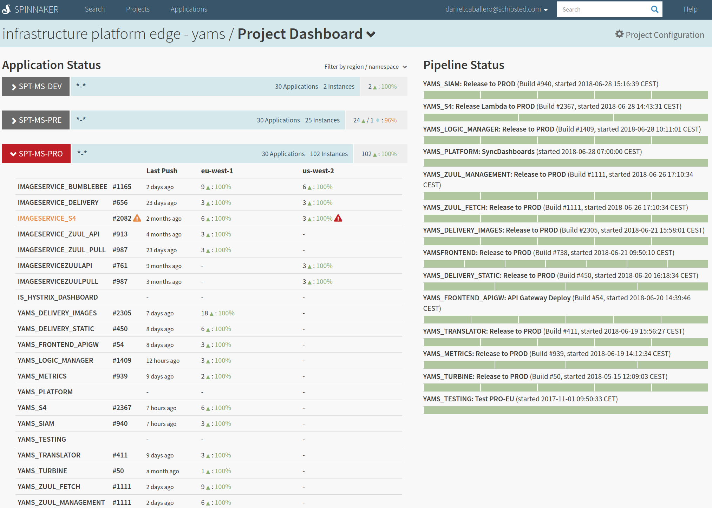

#

## Platform (& development) properties

## IaC

* Most of the services in AWS...
* Generating Cloudformations from [python troposphere](https://github.com/cloudtools/troposphere)
* Managing Cloudformation deployments with [Sceptre](https://github.com/cloudreach/sceptre) 
* New projects with infrastructure definition in the same repo than the service code
    * Trying to extend CD to Infrastructure
* We have assessed [AWS GoFormation](https://github.com/awslabs/goformation)
    * But still lacks some functionality, like GetAtt or Ref 

## Code reviews

```yaml
reviewersRaffle:
  strategies:
    - team-with-knowledge-candidates:
        size: 1
        type: knowledge
        participants:
          teams:
            - spt-infrastructure/edge-team
    - team-random-candidates:
        type: sequential
        size: 2
        participants:
          teams:
            - spt-infrastructure/edge-team
  dailyReminder: enabled
slack:
  - "#spt-edge-prs"
```

##


## Other bots
{ width=60% }

#

## Continuous integration and delivery

## Travis
```yaml
language: go
go:
- 1.9.3
...
script:
- diff -u <(echo -n) <(gofmt -s -d $(find . -type f -name '*.go' -not -path "./vendor/*"))
- docker login -u="$ARTIFACTORY_USER" -p="$ARTIFACTORY_PASSWORD" containers.schibsted.io
- "./requirements/start-requirements.sh -d"
- "_script/tests-docker"
- "_script/compile-docker"
- "_script/cibuild"
...

deploy:
  skip_cleanup: true
  on:
    all_branches: true
  provider: script
  script: _script/deploy
```

## FPM
```bash
fpm -s dir \
	-t rpm \
	-n ${PACKAGE_NAME}${DEV} \
	-v ${VERSION} \
        --iteration ${ITERATION} \
	--description "Yams delivery images. Commit: ${GIT_COMMIT_ID}" \
	--before-install ${TRAVIS_BUILD_DIR}/_pkg/stopservice \
	--after-install ${TRAVIS_BUILD_DIR}/_pkg/postinst \
	--before-remove ${TRAVIS_BUILD_DIR}/_pkg/stopservice \
	--depends datadog-config \
	--depends sumologic-config \
	${DIST_PATH}/${PACKAGE_NAME}/=/
```

## Hardened images
{ width=80% }

## Spinnaker


##


##


## Acceptance & Stress testing

## Locust
{ width=80% }

## Vegeta
{ width=50% }

##


#

## Configuration management

* Using [Netflix Archaius](https://github.com/Netflix/archaius) in all rxJava services
    * Configured with dynamo tables...
    * so dynamic reconfiguration is possible...
    * and quite useful when dealing with outages :)
* ... but [Viper](https://github.com/spf13/viper) in delivery-images
    * No support of DynamoDB to store configurations (etcd, consul)
    * We missed [support to "Get with default"](https://github.com/spf13/viper/pull/232)

## Logs 

*Sumologic*

* Now quite happy... but costs (logging 100G per day)
* Daemon/sidecar with specific config (files to forward)
    
{ width=80% }   
   
##

Using [logrus](https://github.com/sirupsen/logrus) in delivery-images

* Disabling locking
* Time/Date formatting equivalent to the logs in Java
* [Zap](https://github.com/uber-go/zap) could be used... 
    * but not concerned about overhead, as...
    * transforming images is quite resource-intensive

## Monitoring and alerting
And escalations using pagerduty

## Real time monitoring

## Distributed tracing

## S2S resiliency

## Secrets management

## Vulnerability scans
