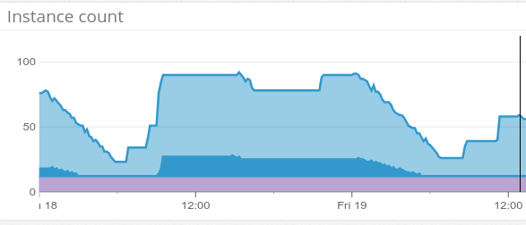

#

## delivery-images implementation details

## HTTP router

## Services communication

* fargo
* eureka
* load balancing
* hystrix

## bi-image + libvips

## Caching

## Zipkin

## Custom metrics

## Gifs..

And rate limits..

## go-kit/negron logrus logging

## Integration tests execution

## Datastore access

## Graceful shutdowns
Autoscaling

AWS SDK usage

## Stresstests

* Locust -> Vegeta
