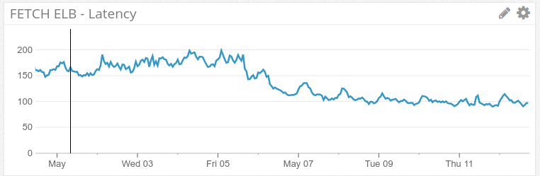
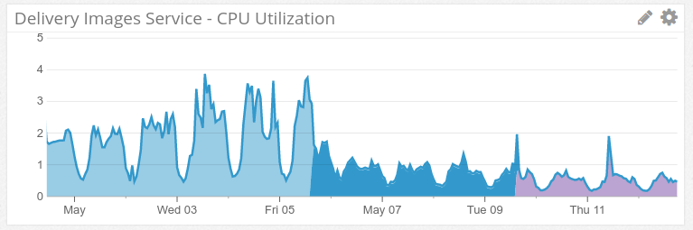
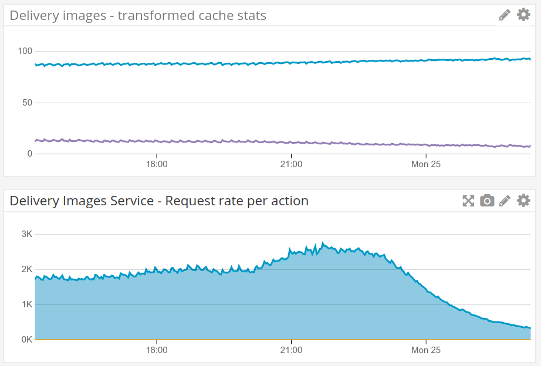
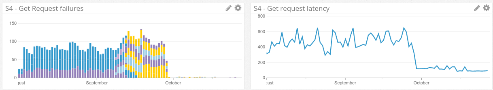

#

## Some delivery-images-specific details

## bi-image + libvips
```go
imageType := bimg.DetermineImageType(imageToTransform.Buffer())

tracing.AddLogToSpanInContext(transformationRequest.Context, "Imagetype: "+bimg.ImageTypeName(imageType))

autoRotate := getAutoRotateFromRule(rule)
if autoRotate {
    err = imageToTransform.AutoRotate()
    if err != nil {
        t.Log.WithField("id", transformationRequest.RequestId).Errorf("Failed to apply autorotation. Error: %v", err)
        return TransformedImage{}, err
    }
}

imageToTransform, err = t.applyBlurring(imageToTransform, transformationRequest)
if err != nil {
    t.Log.WithField("id", transformationRequest.RequestId).Errorf("Failed to apply blurring. Error: %v", err)
    return TransformedImage{}, err
}

if err = t.applyPixelation(imageToTransform, transformationRequest); err != nil {
    t.Log.WithField("id", transformationRequest.RequestId).Errorf("Failed to apply pixelation. Error: %v", err)
    return TransformedImage{}, err
}
```

## 
```go
func (t *VipsTransformer) applyPixelation(imageToTransform *bimg.SchImage, transformationRequest TransformationRequest) error {

	if len(transformationRequest.Rule.GetPixelateAreas()) == 0 {
		return nil
	}

	start := time.Now()
	pixelAreas := make([]bimg.PixelateArea, len(transformationRequest.Rule.GetPixelateAreas()))

	for i, pixelArea := range transformationRequest.Rule.GetPixelateAreas() {
		pixelAreas[i] = bimg.PixelateArea{
			Left:          pixelArea.Left,
			Top:           pixelArea.Top,
			Width:         pixelArea.Width,
			Height:        pixelArea.Height,
			MinNrOfPixels: pixelArea.MinNrOfPixels,
			MinPixelSize:  pixelArea.MinPixelSize,
		}
	}
	defer t.metrics("pixelate", transformationRequest.Context, transformationRequest.RequestId, start)
	return imageToTransform.Pixelate(pixelAreas)
} 
```

## Caching

> Be careful with...


## What we are caching
* *External HTTP responses*, thanks to the CDN
* Local in-memory caches to avoid *s2s calls*
* *Watermarks* cache (also in memory) 
* *Transformations* (in S3)

## What we are NOT caching
* Some controversy in the team in front of [DynamoDB Accelerator/DAX](https://aws.amazon.com/dynamodb/dax/)
* We decided to keep investing in s2s cache rather caching as a (transparent) storage proxy
    * You probably don't want to share a caching cluster between all your microservices

## Implementation
* Using [freecache](https://github.com/coocood/freecache)
    * But we implemented our own for some other entities
* Can manage retention for us, but not very smart, specially compared to
[com.google.common.cache](https://google.github.io/guava/releases/17.0/api/docs/com/google/common/cache/package-summary.html):
    * No background refreshing
    * No locking; one key expiring may mean thousands of backend requests 
* Randomized TTLs, so we avoid all instances expiring contents at the same time

## GIFs and heavy-load transformations
* Media (newspapers) use cases are quite different from marketplaces
    * they use completely dynamic transformations (using JWT)
    * we've seen attempts of:
        * transforming gifs with hundreds of frames (actual short video clips)
        * And also a 21.603x14.400px image (that's 300Mpx)

## 
> Caching does help

* we don't cancel ongoing transformations, so everything eventually gets transformed
* We implemented a "best effort" rate limiting for GIFs..
    * Using DynamoDB tables to prevent doing duplicated work
    * And we protect individual nodes
        * You want to transform frames in parallel...
        * But keeping resources for other type of transformations

## Transformations cache



##


## Datastore access
> Mind VPC S3 endpoints!!


