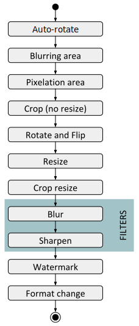

#

## Nice solution... but


<!--
## Why not terraform?
-->

## Why not docker/k8s?

* Local tests
* YAMS Portal/Frontend already there
* Migration exercise

<!--
## And PaaS?
-->

## gRPC?

## Why not a Service Mesh?

## Why not Google Cloud?

<!--
## And Cassandra?
-->

## And Prometheus?

We may. 

And it may be a good moment to consider [opencensus](https://github.com/census-instrumentation/opencensus-go).

#

## Actual (& not so far) future

## Multiregion

* *Buckets already replicated* in two regions per continent
* v0 was running in Oregon and Ireland
* *v1 in Ireland*, and now also being deployed in *Virginia*
    * We may also deploy in Paris of Frankfurt
* Still open discussions in regards to *DynamoDB usage*

## Smoke tests

* We had some *satellites* in v0 calling the API constantly
* Interesting as:
    * Closer to user experience
    * Avoid delays between Cloudwatch and Datadog
* Javascript/client alerting not an option (yet)

## More elasticity to reduce costs

* Changes in transformation rules means *massive eviction* 
    * So we are a bit *overscaled*... 
* *Better degradation* and more *efficient ASG triggers*
    * Reusing cache if no capacity
    * Automatic ASG parameters adjustments
    * Minimize parallelization in the transformation pipe 
    * Incoming queue 

## Extra compression

* Currently *libjpg-turbo*
* Good for performance, pretty decent results, but... 
* [MozJPEG](https://github.com/mozilla/mozjpeg), api-compatible with libjpg
* [guetzli](https://github.com/google/guetzli), from Google

## Bringing the service closer to the business

* Image uploader
* Online image editor
* Integration with data services
    * Automatic classification
    * Nudity detector
    * Car plate pixelation

## More transformation engines

* PDF conv makes sense for attachments (CVs)

```bash
go test -bench . -benchtime 30s -timeout 30m
goos: linux
goarch: amd64
pkg: github.schibsted.io/daniel-caballero/documentsConversionTests
BenchmarkConvertAllFiles/localUnoconv/CV-Templates-Curriculum-Vitae.doc-4                     30        1335211165 ns/op
BenchmarkConvertAllFiles/directLibreOffice/CV-Templates-Curriculum-Vitae.doc-4                50         812129343 ns/op
BenchmarkConvertAllFiles/justCopy/CV-Templates-Curriculum-Vitae.doc-4                      20000           2100841 ns/op
BenchmarkConvertAllFiles/localUnoconv/CV-Templates-Curriculum-Vitae_with_Large_Pic.doc-4                       5        7936095889 ns/op
BenchmarkConvertAllFiles/directLibreOffice/CV-Templates-Curriculum-Vitae_with_Large_Pic.doc-4                  5        7033935000 ns/op
BenchmarkConvertAllFiles/justCopy/CV-Templates-Curriculum-Vitae_with_Large_Pic.doc-4                        2000          29097488 ns/op
BenchmarkConvertAllFiles/localUnoconv/CV-Templates-Curriculum-Vitae_with_Small_Pic.doc-4                      30        1273404605 ns/op
BenchmarkConvertAllFiles/directLibreOffice/CV-Templates-Curriculum-Vitae_with_Small_Pic.doc-4                100         673872470 ns/op
BenchmarkConvertAllFiles/justCopy/CV-Templates-Curriculum-Vitae_with_Small_Pic.doc-4                       30000           1455526 ns/op
BenchmarkConvertAllFiles/localUnoconv/CVTemplate.odt-4                                                        20        1698359980 ns/op
BenchmarkConvertAllFiles/directLibreOffice/CVTemplate.odt-4                                                   50        1057170276 ns/op
BenchmarkConvertAllFiles/justCopy/CVTemplate.odt-4                                                         30000           1560396 ns/op
BenchmarkConvertAllFiles/localUnoconv/CVTemplate_with_Large_Pic.odt-4                                          5        7347933754 ns/op
BenchmarkConvertAllFiles/directLibreOffice/CVTemplate_with_Large_Pic.odt-4                                    10        6864524329 ns/op
BenchmarkConvertAllFiles/justCopy/CVTemplate_with_Large_Pic.odt-4                                           2000          30033113 ns/op
BenchmarkConvertAllFiles/localUnoconv/CVTemplate_with_Small_Pic.odt-4                                         20        1669373873 ns/op
```

##

* Video...


## Actual transformation pipelines


## More adoption?

Some major Marketplaces are not using the service, yet


## ApiGW replacement?

Zuul could be replaced by [Krakend](https://github.com/devopsfaith/krakend)


## Simulating dependencies failures

[Hoverfly](https://github.com/SpectoLabs/hoverfly): similar in concept to the Simian Army from Netflix, 
but especiallized in API degradations
