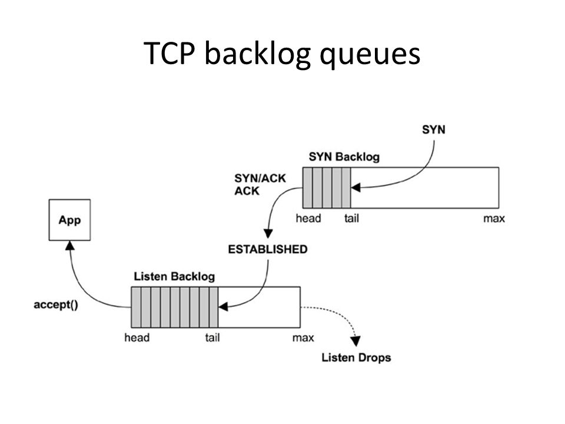

#

## Other related projects


## Price calculator 
```go
func main() {
        defaultMonthsArg := 1
        monthsFlag := NewIntFlag(&defaultMonthsArg)
        weeksFlag := NewIntFlag(nil)
        flag.Var(&monthsFlag, "months", "How many months to go back. Default is applied if weeks are not specified.")
        flag.Var(&weeksFlag, "weeks", "How many weeks to go back. Incompatible with the months argument.")
        debugPtr := flag.Bool("debug", false, "Print debugging information to standard error.")
        outputPtr := flag.String("output", "text", "Define type of output {text|csv}.")
        apiVersionPtr := flag.String("apiversion", "all", "API version to take into account: {all|v1|v0}.")

        // default matches YAMS-team conventions
        profilePtr := flag.String("profile", "spt-ms-pro", "Profile from your aws config files you want to use.")
        engineersPtr := flag.Int("nengineers", 2, "Number of engineers maintaining the service.")
        ddMonthCostPtr := flag.Int("ddogmonthlycost", 4000, "Datadog monthly cost (US $) you want to consider.")
        sumoMonthCostPtr := flag.Int("sumomonthlycost", 16000, "Sumologic monthly cost (US $) you want to consider.")

        flag.Parse()

        if monthsFlag.wasSet && weeksFlag.wasSet {
                output.PrintError("You cannot use months AND weeks arguments at the same time")
                os.Exit(2)
        }
```
   
##
{ width=35% }

{ width=35% }

##
{ width=80% }

<!--
## latencyMAP
Choosing the right regions

-->

## Classifier end to end tests

Again, *go benchmark*:
```bash
% ./_script/run_benchmark
goos: linux
goarch: amd64
pkg: github.schibsted.io/platform-services/yams-classifier-endtoendtest
BenchmarkUploadAndClassifyAllFiles/2MB.jpg-4                  50        1715680610 ns/op
BenchmarkUploadAndClassifyAllFiles/6MB.jpg-4                  30        2427555276 ns/op
BenchmarkUploadAndClassifyAllFiles/lbc_large_1_8MB.jpg-4                      50        2132103767 ns/op
BenchmarkUploadAndClassifyAllFiles/lbc_large_2_8MB.jpg-4                      30        3191113451 ns/op
BenchmarkUploadAndClassifyAllFiles/testCardSmall.jpg-4                       100         801532429 ns/op
PASS
ok      github.schibsted.io/platform-services/yams-classifier-endtoendtest      506.423s
```

##
It almost includes a *YAMS SDK*

```go
yamsConfig, err := yamscfgfile.NewYamsConfig()
if err != nil { 
        b.Fatal(err)
}
yamsClient := yamssdk.NewYamsClient(yamsConfig)
...
imageUrls, reqId, err := yamsClient.Upload(fileReader, "image/jpeg", daysWeWillPreserveUploadedFiles)
if err != nil {
        b.Fatal("Error uploading image", imageFilename, "against YAMS. Reqid:", reqId,
                ". Err:", err)
}
classificationResult, err := dataimagesdk.Classify(imageUrls.StaticDeliveryUrl)
...
```

<!--
# Potential related speeches

## How much magic, and how much DIY?

## Where is the production-ready line?
-->
