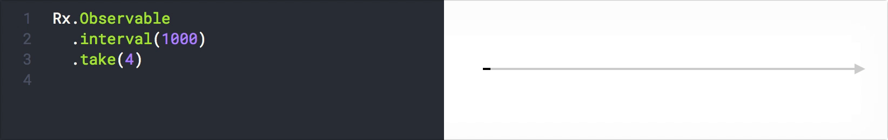
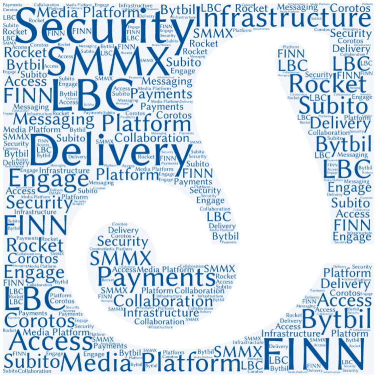

# 

## Before closing...

## Are you going to opensource it?

* Schibsted do support contribution to opensource projects
* As well as releasing internal code
    * See [Github Schibsted organization](https://github.com/schibsted))
* Problem: Not following a "contribute-first" approach
* But already contributed to bimg, zuul, krakenD...
 
## Are you going to offer this SaaS to other companies?

#

## Corollary

## Be Rx in the code...

## But not in real life

#

## 

## Great thanks...
Sch*

## And especially...
*Edge colleagues*
{ width=50% }

## Other Qs?

