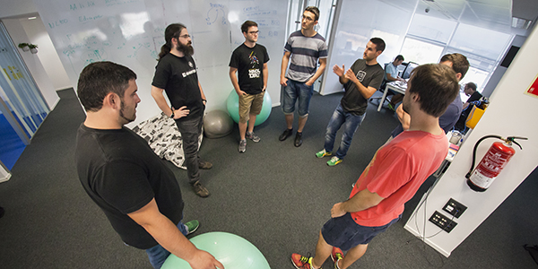

#

## Who are you?

##

 
 
[Daniel Caballero](https://www.linkedin.com/in/danicaba/)

Devops/SRE Engineer @ Schibsted

Part time (Devops) lecturer @ La Salle University

> *I'm sorry. I did NOT write BSD*

## So... I work

## ... I (some kinda) teach

{ width=65% }

## ... I (try to) program...

{ width=70% }

## ... I (would like to) rock...

{ width=35% }

## ... and I live

{ width=70% }

## So... I value my time (a lot)

## And I really don't like to waste it

* In resolving incidents
* In reactive work 
* In repetitive work

<!-- 
TODO: nice 403 image here so firefighters not allowed
-->

