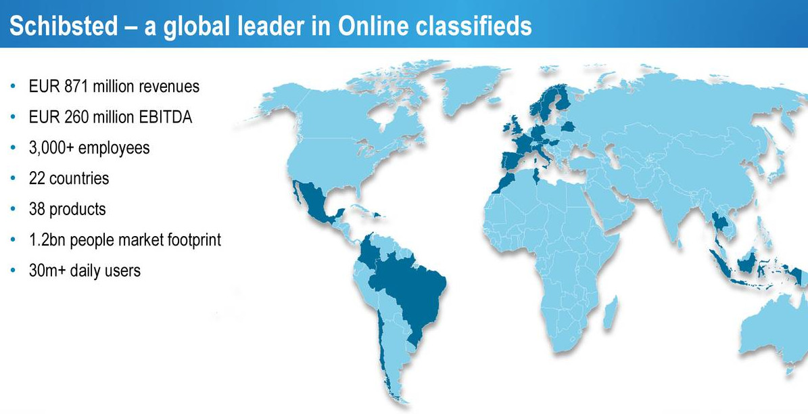
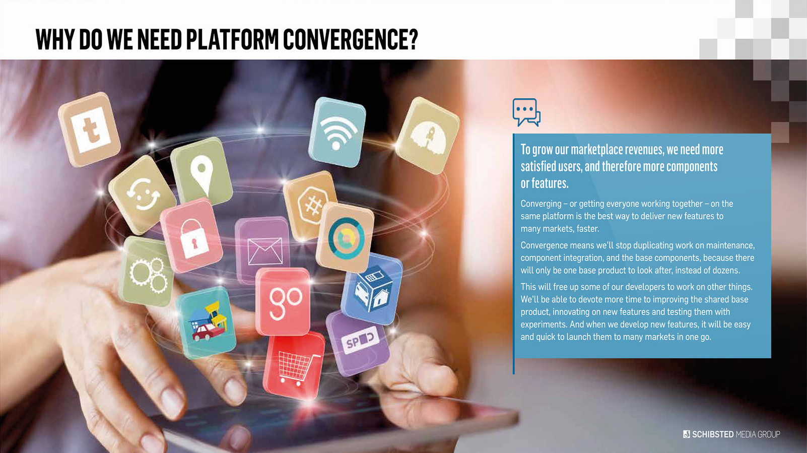

#

## Schibsgrñvahed..WHAT?? 

## What is Schibsted?

{ width=90% }

## 

## And SPT?

It's about convergence through global solutions

## What's behind global components / services?

> `You build it, you run it`
    
Nothing new in the horizon probably for you 

* [first mention in 2006, by Werner Vogels / Amazon](https://queue.acm.org/detail.cfm?id=1142065)
* Nice elaboration behind the rationale [here](https://www.slideshare.net/ufried/the-truth-about-you-build-it-you-run-it)

**That means there's no ops/support/systems/devops team.** 
