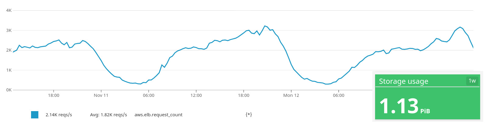

#

## So... 

##

> *Why did you invest time on that?* 

> *Why are you here?* 

<!--
* Sites were doing already that. 
    * So *saving sites time*
* *Cost effective*
    * SaaS is expensive at Schibsted scale
    * We can build & maintain what we really need
* *Close to the Schibsted sites*
    * not just latency (multiregion setup); also feature-set, compliance...
* But solving *other sites needs*:
    * Storage management
    * Document transformation
    * Video streaming
-->

##

{ style="border:0" }

## Availability

## Low latency

## We are the owners of the backlog

## 

Despite sometimes is not so useful...

## Low costs

## High usage

## Effort-less maintenance

* (Almost) No incidents 
* New sites do not require high onboarding efforts

Let's say we dedicate *half an engineer*

##

> We don't (usually) cut people in half, so let's say one engineer

##

> *But be careful: if you stop developing a service, you kill the service*

<!--
* Stops being competitive
* It quickly becomes legacy
* Disconnects from current business needs
-->

## 

So we try to convince the company it requires, at least, the focus of two engineers

## But oncall rotations

{ width=60% }

##

Ok. Let's say 3-4. And we accept an extra project.

