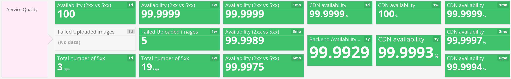

#

## What are you very proud about? 

## High usage

## Does not require high maintenance

(Almost) No incidents. We would be able to maintain this with half an engineer

* We dont like to cut people in half, so let's say one engineer

##

> **But be careful: if you stop developing a service, you kill a service**

* Stops being competitive
* It quickly becomes legacy (old stack, old libs, old design)
* Disconnect from current business needs

So we try to convince the company it requires, at least, the focus of two engineers.

## Low costs

## 

## Low latency

