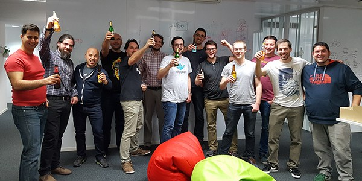

#

## What are you very proud about? 

## High usage

## Does not require high maintenance
(Almost) No incidents. We would be able to maintain this with a single engineer

But be careful: if you invest 0 efforts, you kill a service
* Stops being competitive
* Starts being legacy
* Starts to disconnect from current needs

So we try to convince the company it requires, at least, the focus of two engineers.

## Low costs

## 

## Low latency

## Not a new story... why not presenting it before?

