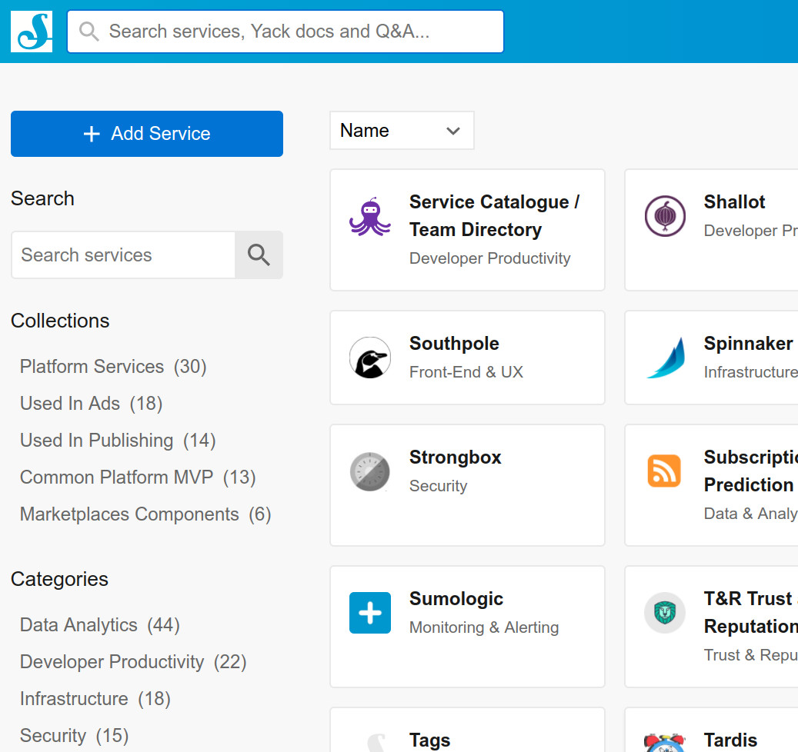
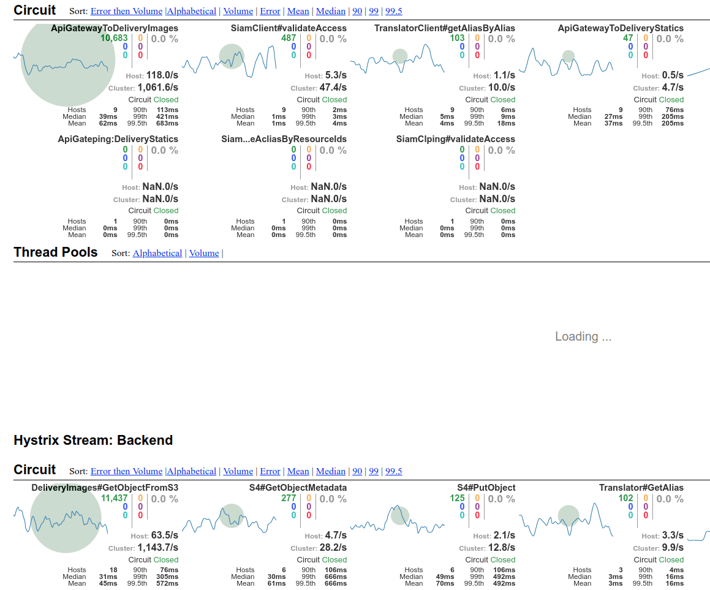

#

## How did you achieved that?

## Combination of...

{ style="border:0; box-shadow:none" }

## Don't you see some similarity?

{ style="border:0; box-shadow:none; width:70.0%" }

#

## Team

{ width=70% }

## Agile

{ width=70% }

* *Continuous improvement*
    * Experiment. Its about to play. Prompt feedback. **Sometimes you win. Sometimes you learn**
* *Autonomous*
    * **Transversal team**. We have our own providers accounts. Directly in touch with sites/clients

## Benefiting from other Sch services

Reusability of other colleagues code/components

{ width=50% }

## Collaboration and transparency

 
 

* Internal RFCs
* Consumers as contributors
* Internal opensource model 

#

## Product

{ width=40% }

## There is an actual need

Project was initiated by and for several sites that had a common problem

{ width=70% }

## Limited scope

* API as the point of interaction
* No business logic. "Dumb" service
* Almost no-functionality that is used by a single site, or not used at all

## As-a-service experience

* Self-service
* Multitenant API
* Metrics reporting per tenant

#

## Tech

{ width=40% }

## Good design/tech choices

##

* Immutable pattern
* Microservices
* AWS + Netflix stack
* libvips
* Non-blocking services

##
> *But not perfect neither the best, for sure*

## Everything as code 

No space for "one time" actions.

* Alerting configuration by code
* Infrastructure  
* (Most of the) application configuration

## Continuous Delivery

And capacity to incorporate everything to the pipeline. 

Small deltas. Iterative deliveries. Low risk deployments. And be smart assuming risks

## 
{ style="border:0; box-shadow:none" }

##
> *Look forward, rather than investing lots of time in your rollback strategy*

## 0-error target
{ width=70% }

##
{ width=40% }

Yeah, Google also states something different by introducing error budgets...

##
... but helped us:
 
* to *understand & tune* the platform,
* get *trust* from Sch sites, avoiding major disruptions when big sites onboarded, 
* and *minimizing unplanned* / reactive activities

## Observability toolkit

* Shit happens
    * *let's minimize pain*
* Unlocks *experimentation culture*
    * As understanding what happens becomes easier 

##
{ width=80% }

## 
If we connect this to immutability...

{ width=60% }

> *Incident troubleshooting can become a forensics exercise*
