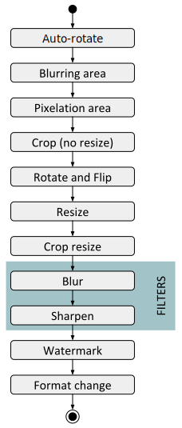

#

## Nice solution... but

## Why not docker/k8s?

* Local tests
* YAMS Portal/Frontend already there
* Migration exercise

## Why not a Service Mesh?

## And Prometheus?

We may. 

And it may be a good moment to consider [opencensus](https://github.com/census-instrumentation/opencensus-go).

#

## Actual (& not so far) future

## Extra compression

* Currently *libjpg-turbo*
* Good for performance, pretty decent results, but... 
* [MozJPEG](https://github.com/mozilla/mozjpeg), api-compatible with libjpg
* [guetzli](https://github.com/google/guetzli), from Google

## Bringing the service closer to the business

* Image uploader
* Online image editor
* Integration with data services
    * Automatic classification
    * Nudity detector
    * Car plate pixelation
* More regions/cloud providers deployments

##

* Video transcoding...

## Actual transformation pipelines
{ style="border:0" }

## More adoption?

Some major Marketplaces are not using the service, yet

## Simulating dependencies failures

[Hoverfly](https://github.com/SpectoLabs/hoverfly): similar in concept to the Simian Army from Netflix, 
but specialized in API degradations

## Stress test as part of the pipeline

## GCP as an accelerator of South America?
